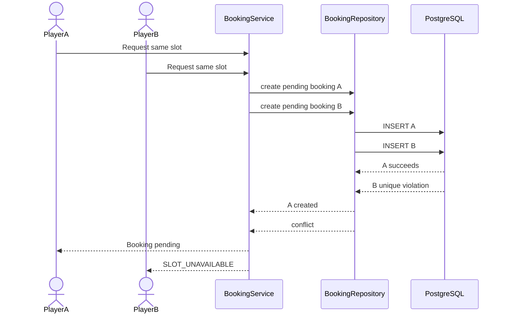
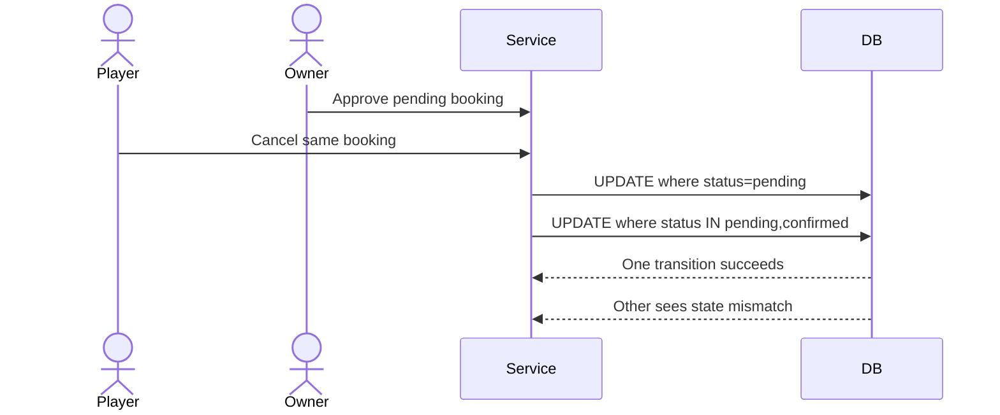

# ADR 001 — Booking Slot Exclusivity

**Status:** Proposed
**Decision Type:** Persistence / Concurrency
**Related Domain:** Booking, Availability
**Related Architecture:** `ARCHITECTURE.md`

---

## 1. Context

The booking flow allows a player to request one fixed court slot.

A slot is identified by:

```text
court
+
booking date
+
start time
+
end time
```

When a player successfully submits a booking request:

```text
available
   ↓
pending
   ↓
slot locked
```

The MVP requires that only one active booking can hold a slot at a time.

Active locking states are:

```text
pending
confirmed
```

Non-locking states are:

```text
rejected
cancelled
expired
completed
```

The critical concurrency scenario is:

```text
Player A sees 7:00–8:00 PM available
Player B sees 7:00–8:00 PM available

Player A submits
Player B submits
```

Both requests may reach the backend at nearly the same time.

An application-level sequence such as:

```text
SELECT available?
      ↓
yes
      ↓
INSERT booking
```

is not sufficient by itself.

Both requests could observe the slot as available before either insert becomes visible to the other.

The database must therefore participate in enforcing slot exclusivity.

---

# 2. Existing Architecture Constraints

The existing backend standard establishes the following relevant constraints.

## Service owns business operations

Transaction boundaries belong in the service because the service defines the complete business operation.

The booking operation therefore belongs conceptually in:

```text
BookingService.createBooking()
```

rather than inside the repository or route.

---

## Repository reports persistence facts

The repository should not decide whether a booking conflict represents a business error.

It may report:

```text
constraint violation
```

or a persistence result.

The service translates that fact into domain behavior such as:

```text
SLOT_UNAVAILABLE
```

---

## Current database driver

The existing architecture uses:

```text
neon-http
```

The house standard deliberately avoids moving to a WebSocket/pooled driver until interactive transactions are actually required.

This ADR must therefore determine whether booking exclusivity can be implemented safely without introducing interactive transactions.

---

# 3. Decision Drivers

The solution should satisfy the following requirements.

## D1 — Correct under concurrency

Two concurrent booking requests must not successfully acquire the same court slot.

---

## D2 — Database-enforced invariant

Correctness must not depend only on application timing.

---

## D3 — Preserve existing architecture

The solution should work with:

```text
Cloudflare Workers
Hono
Neon PostgreSQL
Drizzle
neon-http
```

unless there is a concrete reason to change the database driver.

---

## D4 — Keep booking service testable

Booking business logic must remain callable without HTTP.

---

## D5 — Avoid unnecessary infrastructure

Do not introduce:

- Distributed locks
- Redis locks
- Durable Objects
- Queue-based reservation coordination
- A custom locking service

unless PostgreSQL cannot enforce the requirement cleanly.

---

## D6 — Allow historical booking records

Rejected, cancelled, expired, and completed bookings must remain stored.

The exclusivity mechanism therefore cannot simply require all historical booking records to be unique forever.

---

# 4. Considered Approaches

## Option A — Application Check Only

Conceptually:

```text
SELECT bookings
WHERE court/date/slot is active

if none:
    INSERT pending booking
```

### Advantage

Simple application code.

### Problem

Unsafe under concurrent requests.

Example:

```text
Request A → checks → available
Request B → checks → available

Request A → inserts
Request B → inserts
```

Both may succeed.

### Decision

Rejected.

A business invariant this important must not depend on a race-prone read-before-write check.

---

# 5. Option B — Application Lock Service

A separate locking system could manage:

```text
court + date + slot
```

Possible technologies include:

- Redis
- Durable Objects
- Distributed lock services

### Advantages

Can provide explicit reservation locks.

### Problems

Adds another stateful system.

The lock and PostgreSQL booking record could disagree:

```text
Lock exists
Booking missing
```

or:

```text
Booking exists
Lock missing
```

It would also introduce infrastructure that is unnecessary if PostgreSQL already owns the underlying booking state.

### Decision

Rejected for MVP.

---

# 6. Option C — Database Uniqueness Constraint

PostgreSQL should enforce the invariant directly.

The desired rule is:

> For a specific court/date/time slot, only one booking in an active locking state may exist.

Conceptually:

```text
UNIQUE(
    court_id,
    booking_date,
    start_time,
    end_time
)
WHERE status IN ('pending', 'confirmed')
```

This allows historical records such as:

```text
rejected
cancelled
expired
completed
```

without permanently blocking the slot.

### Advantages

- Atomic at the database level.
- Safe under concurrent inserts.
- No external locking infrastructure.
- The database remains the authority.
- Fits PostgreSQL well.
- Compatible with the existing service/repository architecture.

### Decision

Selected.

---

# 7. Decision

Booking slot exclusivity will be enforced using a PostgreSQL **partial unique index** covering the court and slot identity for active booking states.

Conceptually:

```sql
CREATE UNIQUE INDEX bookings_active_slot_unique
ON bookings (
    court_id,
    booking_date,
    start_time,
    end_time
)
WHERE status IN ('pending', 'confirmed');
```

The exact SQL will be generated and reviewed through the existing Drizzle migration workflow.

---

# 8. Slot Identity

For the MVP, a slot is uniquely identified by:

```text
court_id
booking_date
start_time
end_time
```

These values represent the actual booking snapshot.

The system should not rely only on an ephemeral generated slot identifier unless the availability model later chooses to persist slot entities.

---

# 9. Active Booking Definition

The unique constraint applies only to:

```text
pending
confirmed
```

because these states hold the slot.

State behavior:

| Status      | Holds Slot |
| ----------- | ---------: |
| `pending`   |        Yes |
| `confirmed` |        Yes |
| `rejected`  |         No |
| `cancelled` |         No |
| `expired`   |         No |
| `completed` | Historical |

---

# 10. Why Completed Is Not Part of the Constraint

A completed booking references a past slot.

The date/time itself prevents that historical period from being booked again.

There is therefore no need for `completed` to participate in the active-slot uniqueness rule.

Keeping it outside the partial index also allows historical records without affecting active-slot constraint logic.

---

# 11. Booking Creation Flow

Booking creation becomes:



Only one request can succeed.

---

# 12. Repository Responsibility

The repository performs persistence.

Conceptually:

```text
BookingRepository.create(...)
```

may encounter PostgreSQL:

```text
23505
```

for the active-slot unique index.

The repository must not decide that this means:

```text
SLOT_UNAVAILABLE
```

That is business policy.

---

# 13. Service Responsibility

The booking service owns the domain interpretation.

Conceptually:

```text
database uniqueness violation
        ↓
BookingService
        ↓
SlotUnavailableError
```

The service should only translate the relevant booking-slot constraint violation.

Not every PostgreSQL `23505` should automatically mean:

```text
SLOT_UNAVAILABLE
```

because other unique constraints may exist.

The constraint name should therefore be identifiable.

Example conceptual name:

```text
bookings_active_slot_unique
```

---

# 14. Error Translation

The final domain error should be stable and client-readable.

Conceptually:

```text
SLOT_UNAVAILABLE
```

Possible HTTP representation:

```json
{
	"error": {
		"code": "SLOT_UNAVAILABLE",
		"message": "This time slot is no longer available.",
		"requestId": "..."
	}
}
```

The existing edge error handler remains responsible for translating the domain error to an HTTP response.

---

# 15. Availability Check Still Exists

The database constraint does **not** replace normal availability validation.

Before attempting booking creation, the service should still validate:

- Court exists.
- Venue is valid.
- Court is active.
- Selected date is within booking window.
- Slot follows the court's configured schedule.
- Date exception does not close the court.
- Slot has not started.
- Slot is not known to be unavailable.

This provides good user-facing validation.

The unique index provides the final concurrency guarantee.

Conceptually:

```text
Application validation
        +
Database constraint
        =
Correct booking creation
```

---

# 16. Do We Need an Interactive Transaction?

For slot exclusivity alone:

**No.**

The partial unique index makes competing booking inserts atomic from the application's perspective.

A single booking insert does not require:

```text
BEGIN
SELECT FOR UPDATE
INSERT
COMMIT
```

just to prevent duplicate active reservations.

Therefore this ADR does **not** currently justify replacing `neon-http`.

The existing architecture decision to keep the stateless HTTP driver remains valid.

---

# 17. When a Transaction May Become Necessary

A future booking operation may require multiple database writes that must succeed or fail together.

For example:

```text
Create booking
+
Consume prepaid credit
+
Create payment record
+
Update inventory
```

If such a requirement appears, interactive transaction support should be reevaluated.

That is not required by the current pay-at-venue MVP.

---

# 18. Booking Approval

Approval changes:

```text
pending → confirmed
```

Both states participate in the same partial unique index.

Therefore the transition does not release the slot.

Conceptually:

```text
pending
   ↓
confirmed

slot ownership unchanged
```

---

# 19. Booking Rejection

Rejection changes:

```text
pending → rejected
```

`rejected` does not participate in the partial unique index.

Once the update commits:

```text
slot becomes available
```

A new booking may then acquire the same slot.

---

# 20. Booking Cancellation

Player cancellation changes:

```text
pending → cancelled
```

or:

```text
confirmed → cancelled
```

`cancelled` is outside the active-slot index.

After the update succeeds, another booking may acquire that future slot.

---

# 21. Booking Expiry

Expiry changes:

```text
pending → expired
```

The active uniqueness claim is removed.

However, the slot start time has already been reached.

Therefore normal availability validation prevents the slot from being booked again.

This preserves the distinction:

```text
lock released
```

does not necessarily mean:

```text
slot currently bookable
```

---

# 22. State Transition Concurrency

Slot exclusivity solves creation conflicts, but booking state transitions can also race.

Example:

```text
Owner approves
```

while:

```text
Player cancels
```

Both may start from a client view showing:

```text
pending
```

State updates should therefore be conditional on the expected current state.

Conceptually:

```sql
UPDATE bookings
SET status = 'confirmed'
WHERE id = ?
AND status = 'pending';
```

If affected rows:

```text
1 → transition succeeded
0 → booking state already changed
```

This avoids:

```text
cancelled → confirmed
```

or other stale-state transitions.

---

# 23. Conditional State Updates

The repository should expose operations that preserve expected-state semantics.

Conceptually:

```text
approvePendingBooking(id)

rejectPendingBooking(id)

cancelPendingOrConfirmedBooking(id)
```

The exact repository API may differ, but persistence must prevent invalid state transitions caused by concurrent operations.

The service remains responsible for deciding what a zero-row update means in the domain.

---

# 24. Example Approval Race



The final database state must correspond to one valid transition rather than a last-write-wins overwrite.

---

# 25. Database Constraint

Conceptual Drizzle schema:

```ts
uniqueIndex('bookings_active_slot_unique')
	.on(
		bookings.courtId,
		bookings.bookingDate,
		bookings.startTime,
		bookings.endTime,
	)
	.where(sql`${bookings.status} in ('pending', 'confirmed')`);
```

The actual implementation must follow the repository's Drizzle version and migration conventions.

The generated SQL must be reviewed before application.

---

# 26. Why Not Store `isLocked`

Do not add:

```text
booking.is_locked
```

or:

```text
slot.locked
```

merely to represent booking ownership.

That would duplicate information already represented by booking status.

For example:

```text
status = pending
is_locked = false
```

would become an impossible contradictory state.

The lock is derived from:

```text
status IN (pending, confirmed)
```

---

# 27. Why Not Persist Generated Slots Yet

Availability currently generates fixed slots from:

```text
weekly schedule
+
date exceptions
+
slot duration
```

Persisting every future generated slot would create:

- Large amounts of derived data
- Synchronization problems after schedule changes
- Extra cleanup requirements
- Another source of truth

For the MVP, booking records should snapshot their actual:

```text
date
start time
end time
```

while availability remains derived.

A dedicated slot table should only be introduced if future requirements justify it.

---

# 28. Domain Invariant

The database-level invariant is:

> At most one booking whose status is `pending` or `confirmed` may exist for the same court, booking date, start time, and end time.

This invariant must hold regardless of:

- Number of backend instances
- Request concurrency
- Client retries
- Network timing

---

# 29. Client Behavior

The client may optimistically display available slots from the availability endpoint.

However:

```text
displayed available
```

does not mean:

```text
guaranteed reservation
```

The reservation becomes valid only after the booking API successfully creates the pending booking.

If another player acquires it first, the client receives:

```text
SLOT_UNAVAILABLE
```

and should refresh availability.

---

# 30. Idempotency

General idempotency keys are explicitly outside the current backend standard.

This ADR does not introduce them.

If duplicate submissions from the same player later become a meaningful problem, idempotency should receive a separate architecture decision rather than being mixed into slot exclusivity.

---

# 31. Migration

The booking table migration must create the active-slot unique index.

Migration workflow follows the existing standard:

```text
Modify Drizzle schema
      ↓
bun run db:generate
      ↓
Review SQL
      ↓
Commit migration
      ↓
CI applies migration
```

Production must not use:

```text
db:push
```

for this change.

This follows the existing migration rules in `ARCHITECTURE.md`.

---

# 32. Testing Requirements

The booking module must include concurrency-focused tests.

At minimum:

## TEST-001

Create a pending booking for a free slot.

Expected:

```text
success
```

---

## TEST-002

Attempt another pending booking for the same court/date/time.

Expected:

```text
SLOT_UNAVAILABLE
```

---

## TEST-003

Reject the first booking, then request the same slot again.

Expected:

```text
success
```

---

## TEST-004

Cancel the first booking, then request the same slot again.

Expected:

```text
success
```

---

## TEST-005

Confirm the first booking, then request the same slot.

Expected:

```text
SLOT_UNAVAILABLE
```

---

## TEST-006

Two concurrent requests attempt the same slot.

Expected:

```text
exactly one succeeds
exactly one fails with SLOT_UNAVAILABLE
```

---

# 33. Consequences

## Positive

- Slot exclusivity is enforced by PostgreSQL.
- Concurrent requests remain safe.
- No external lock system is required.
- Existing `neon-http` architecture can remain.
- Historical booking records remain possible.
- Booking status remains the source of truth.
- The design is straightforward to test.

---

## Negative

The partial index contains business-state knowledge:

```text
pending
confirmed
```

Changing which states hold a slot requires a schema/index migration.

This is acceptable because slot ownership is a critical database invariant and should not be casually changeable.

---

# 34. Rejected Alternatives

The following approaches are rejected for the MVP:

- Application-only availability checks
- In-memory locks
- Cloudflare isolate-level locks
- Redis locking
- Durable Object reservation locks
- Persisted `isLocked` flags
- Pre-generating every future slot
- Switching database drivers solely for slot exclusivity

---

# 35. Follow-Up Decisions

This ADR resolves only slot exclusivity and concurrency around booking states.

Separate ADRs remain useful for:

```text
002 — Venue geospatial search

003 — Venue image storage

004 — Push notification delivery

005 — Scheduled booking expiry/completion
```

Interactive transactions should only receive a dedicated ADR if a future operation actually requires them.

---

# 36. Decision

Use a PostgreSQL partial unique index to guarantee one active booking per:

```text
court
+
date
+
start time
+
end time
```

where active means:

```text
pending
confirmed
```

Use conditional state updates to protect booking transitions from concurrent/stale actions.

Do not introduce an external lock manager or change away from the current `neon-http` driver solely for booking slot exclusivity.

---

# 37. Status

**Status:** Accepted for MVP architecture
