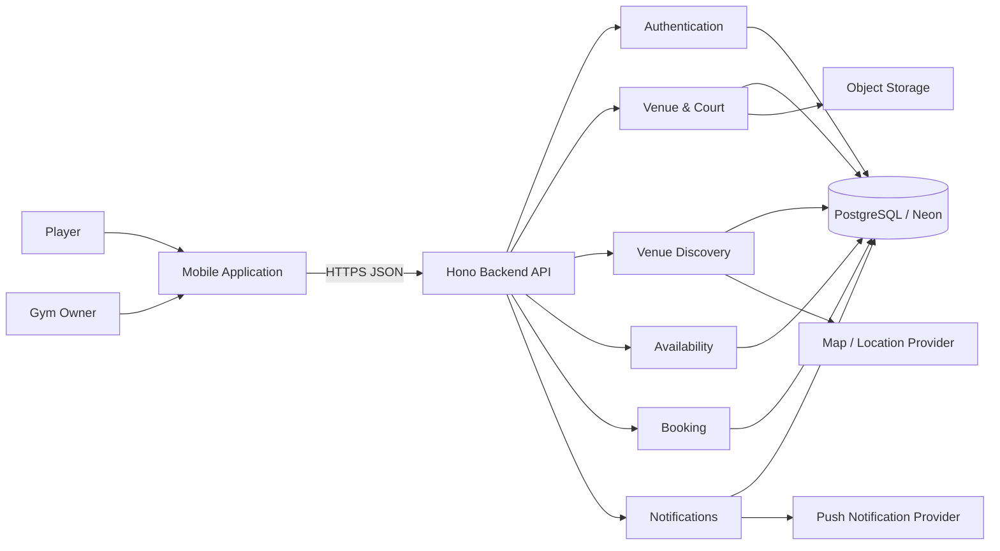
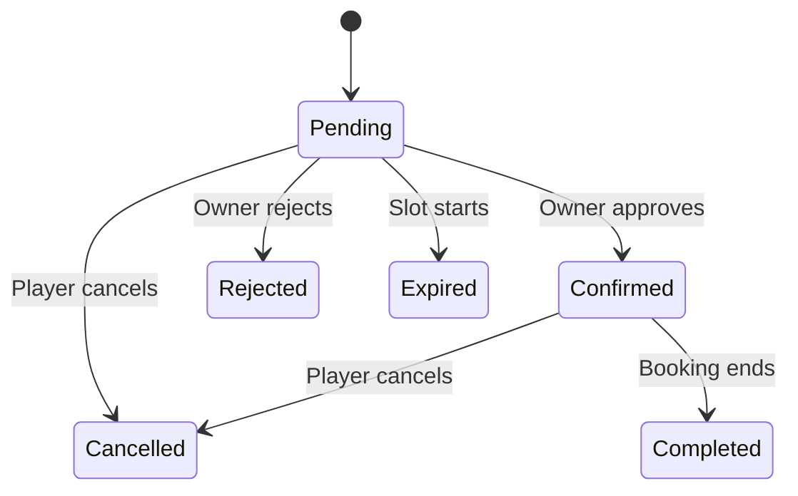
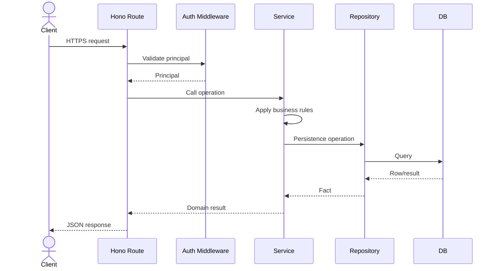

# System Architecture Overview

## 1. Purpose

This document describes the high-level architecture of the community sports venue discovery and booking platform.

It explains:

- System boundaries
- Client and backend responsibilities
- Backend module boundaries
- External services
- Data ownership
- Authentication
- Venue discovery
- Booking
- Availability
- Notifications
- Architectural constraints

Detailed backend implementation rules are defined separately in:

```text
ARCHITECTURE.md
```

That document remains the normative backend code and architecture standard.

---

# 2. System Context

The MVP consists primarily of:

```text
Mobile Client
     │
     │ HTTPS / JSON
     ▼
Backend API
     │
     ├── Authentication
     ├── Venue Management
     ├── Venue Discovery
     ├── Availability
     ├── Booking
     └── Notifications
     │
     ▼
PostgreSQL
```

External infrastructure may additionally provide:

- Map/location services
- Image/file storage
- Push notification delivery

---

# 3. High-Level Architecture



---

# 4. Backend Runtime

The backend follows the existing Sport API architecture.

Current technology direction:

```text
Runtime:
Cloudflare Workers

HTTP Framework:
Hono

Database:
PostgreSQL / Neon

ORM:
Drizzle

Validation:
Zod + drizzle-zod

Authentication:
Better Auth

API Documentation:
OpenAPI + Scalar
```

Backend implementation must follow the repository's normative:

```text
ARCHITECTURE.md
```

---

# 5. Backend Architectural Principles

The backend preserves the following established principles.

## Explicit Dependency Injection

Dependencies are passed explicitly.

Conceptually:

```text
env
 ↓
database
 ↓
repository
 ↓
service
 ↓
route
```

No application-wide dependency injection framework is required.

---

## Thin Transport Layer

Routes are responsible for:

- Request parsing
- Runtime validation
- Authentication middleware
- Calling a service
- Serializing the response

Routes must not contain booking or venue business policy.

---

## Business Logic in Services

Services own product rules such as:

```text
Can this player book this slot?

Can this owner approve this booking?

Should this booking expire?

Is this venue eligible for publication?
```

Services remain independent of HTTP so they may later be invoked from:

- HTTP requests
- Scheduled tasks
- Queues
- Tests

---

## Persistence in Repositories

Repositories handle database operations and report persistence facts.

Repositories must not make product-policy decisions.

For example:

```text
Repository:
find booking → null

Service:
null → booking not found
```

---

# 6. Vertical Slice Modules

The backend uses feature-oriented modules rather than global horizontal business layers.

The MVP should map naturally to:

```text
src/modules/

auth/
user/
venue/
court/
availability/
booking/
notification/
```

However, module boundaries should remain cohesive.

For example, if court management has no independent business lifecycle outside venue management, it may initially belong inside:

```text
modules/venue/
```

rather than creating unnecessary modules.

The existing rule remains:

> A module should be a deletable unit.

---

# 7. Proposed MVP Backend Modules

A reasonable initial module layout is:

```text
src/modules/
├── user/
├── venue/
├── availability/
├── booking/
└── notification/
```

Authentication remains under the existing:

```text
src/auth/
```

because Better Auth already owns authentication infrastructure.

---

# 8. User Module

The user module represents application users and basic profile information.

Roles:

```text
player
gym_owner
```

Responsibilities may include:

- User profile retrieval
- Player profile
- Gym-owner profile
- Role-related application data

Authentication credentials remain owned by Better Auth.

---

# 9. Venue Module

The venue module owns:

```text
Gym Owner
   ↓
Venue
   ↓
Court
```

Responsibilities:

- Create venue
- Edit venue
- Publish/unpublish venue
- Create court
- Edit court
- Activate/deactivate court
- Configure sport
- Configure price
- Configure booking advance window
- Validate ownership
- Validate publication eligibility

---

# 10. Availability Module

Availability owns court schedule rules.

Responsibilities:

- Weekly court schedules
- Multiple operating periods
- Slot duration
- Date exceptions
- Closed dates
- Slot generation
- Availability queries

Conceptually:

```text
Court Configuration
        ↓
Weekly Schedule
        +
Date Exceptions
        +
Slot Duration
        ↓
Candidate Slots
```

Booking state must then be considered before a slot is exposed as available.

---

# 11. Booking Module

Booking is the primary transactional domain of the application.

Responsibilities:

- Create booking request
- Validate booking eligibility
- Lock court slot
- Approve booking
- Reject booking
- Player cancellation
- Booking expiry
- Booking completion
- Booking history
- Booking authorization

State model:



---

# 12. Booking Transaction Boundary

Booking creation is a business operation and therefore belongs in the service layer.

Conceptually:

```text
BookingService.createBooking()

1. Validate player
2. Validate venue/court
3. Validate slot
4. Check slot availability
5. Acquire booking slot
6. Create pending booking
7. Commit operation
8. Trigger notification
```

The exact transaction mechanism depends on the final Neon/driver strategy.

The existing backend architecture explicitly places transaction boundaries in services.

---

# 13. Slot Conflict Protection

The system must guarantee:

```text
Only one active booking
for:

court
+
date
+
start/end slot
```

Application-level checks alone are insufficient because two requests can occur concurrently.

Conceptually:

```text
Player A ─┐
          ├── request same slot
Player B ─┘
              ↓
        Booking Service
              ↓
      Persistence constraint
              ↓
      only one succeeds
```

The specific database constraint will be defined in the data-model architecture.

---

# 14. Booking and Availability Relationship

Availability and booking are separate concepts.

Availability determines:

> Should this slot theoretically be bookable?

Booking determines:

> Has someone already acquired this slot?

Conceptually:

```text
Court schedule
     +
Date exception
     +
Slot duration
     ↓
Potential slot
     ↓
Booking lock?
   /       \
 Yes       No
 ↓          ↓
Unavailable Available
```

This separation prevents booking records from becoming the schedule definition.

---

# 15. Authentication

Authentication uses the existing Better Auth implementation.

Clients may authenticate through supported session/bearer mechanisms.

The backend resolves an authenticated principal before protected actions.

---

# 16. Authorization

Two authorization levels exist.

## Coarse Authorization

Handled near the HTTP boundary.

Examples:

```text
Authenticated?
Player?
Gym owner?
Required scope?
```

---

## Resource Authorization

Handled inside services.

Examples:

```text
Does this venue belong to this owner?

Does this booking belong to this player?

Does this booking belong to a venue managed by this owner?
```

This follows the existing backend architecture rule that fine-grained ownership checks belong in services.

---

# 17. Venue Discovery

Discovery uses the player's active location context to search published venues.

Conceptually:

```text
Player Location
      ↓
Discovery Query
      ↓
Published Venues
      ↓
Location Filtering
      ↓
Sport Filtering
      ↓
Results
```

The database implementation may use geospatial capabilities or another suitable strategy.

The exact approach remains an architecture decision.

---

# 18. Maps and Location

The mobile application may obtain:

```text
device location
```

or:

```text
manual location selection
```

The backend should receive a normalized discovery location rather than depend on device-specific location APIs.

Conceptually:

```text
Mobile Device
    ↓
lat / lng or selected location
    ↓
Discovery API
```

Map rendering itself remains a client responsibility.

---

# 19. Venue Images

Venue images should not be stored directly inside PostgreSQL.

Recommended system boundary:

```text
Mobile
  ↓
Upload
  ↓
Object Storage
  ↓
Image URL / key
  ↓
Venue record
```

The specific storage provider can be selected later.

---

# 20. Notification Module

The notification module owns persistent in-app notification records.

Responsibilities:

- Create notification from successful domain event
- Notification history
- Read/unread state
- Notification ownership
- Push delivery coordination

Notification creation should occur only after the corresponding business operation succeeds.

---

# 21. Push Notifications

Push delivery is an external side effect.

Conceptually:

```text
Booking confirmed
      ↓
Domain operation succeeds
      ↓
Notification created
      ↓
Push delivery attempted
```

Push failure must never roll back the booking.

---

# 22. Automatic Booking Expiry

Pending bookings must expire when their slot begins.

The backend architecture already requires services to remain callable outside HTTP, which supports scheduled processing.

Conceptually:

```text
Scheduled Worker
      ↓
BookingService.expirePendingBookings()
      ↓
Find eligible pending bookings
      ↓
pending → expired
      ↓
release lock
      ↓
notification
```

The scheduling mechanism should invoke the same service logic used by the domain rather than duplicate rules in the scheduled handler.

---

# 23. Automatic Completion

Confirmed bookings may similarly be completed after their end time.

Conceptually:

```text
Scheduled Worker
      ↓
BookingService.completeBookings()
      ↓
confirmed → completed
```

The exact scheduling frequency is an implementation decision.

---

# 24. API Design

The application uses versioned HTTP APIs.

Existing convention:

```text
/v1/...
```

Possible resource groups:

```text
/v1/users
/v1/venues
/v1/venues/:venueId/courts
/v1/courts/:courtId/availability
/v1/bookings
/v1/notifications
```

These are conceptual resource boundaries, not finalized endpoint definitions.

The actual contract belongs in:

```text
docs/api/openapi.yaml
```

or the generated Hono OpenAPI specification.

---

# 25. Schema Source of Truth

The backend's existing schema chain remains authoritative:

```text
Drizzle Table
      ↓
drizzle-zod
      ↓
Zod
      ↓
TypeScript
      ↓
OpenAPI
```

New sports-domain modules must follow this standard.

Do not create separate hand-maintained API models that duplicate database-backed schema definitions unless the field is explicitly computed or a distinct wire model is required.

---

# 26. Domain Errors

Services throw application/domain errors rather than HTTP-specific exceptions.

Examples could include:

```text
BOOKING_NOT_FOUND
SLOT_UNAVAILABLE
BOOKING_EXPIRED
BOOKING_NOT_PENDING
VENUE_NOT_FOUND
VENUE_NOT_PUBLISHABLE
UNAUTHORIZED_VENUE_ACCESS
```

The HTTP edge translates these into the established error envelope.

---

# 27. Pagination

List resources should follow the existing backend pagination standard.

Cursor pagination remains the default where suitable.

Likely cursor-paginated resources include:

- Venue discovery
- Player booking history
- Owner booking history
- Notifications

Offset pagination should only be introduced where a numbered-page UX genuinely requires it.

---

# 28. Observability

The existing request correlation strategy should apply to all new modules.

Every important operation should preserve:

```text
requestId
```

Relevant domain logs may later include events such as:

```text
booking.created
booking.confirmed
booking.rejected
booking.cancelled
booking.expired

venue.published
venue.unpublished
```

Logs should describe important operations without containing sensitive user data.

---

# 29. Proposed Request Flow

A typical protected request follows:



---

# 30. Module Dependency Direction

The existing backend dependency rules remain unchanged.

```text
Routes
  ↓
Services
  ↓
Repositories
  ↓
Database
```

Cross-module communication must use services.

Example:

```text
BookingService
    ↓
VenueService
```

is allowed when booking requires venue-domain behavior.

This is not allowed:

```text
BookingService
    ↓
VenueRepository
```

because that bypasses the venue module contract.

---

# 31. Core Dependency Rule

`core/` remains feature-agnostic.

Sports-specific concepts must not be added to:

```text
src/core/
```

For example, these do not belong in `core/`:

```text
BookingStatus
Court
Venue
Sport
```

They belong in their corresponding feature/domain modules.

---

# 32. Proposed Backend Structure

Tailored to the MVP:

```text
src/
├── app.ts
├── container.ts
├── env.ts
│
├── auth/
│   ├── better-auth.ts
│   ├── principal.ts
│   └── routes.ts
│
├── core/
│   ├── errors.ts
│   ├── logger.ts
│   ├── http/
│   ├── middleware/
│   └── pagination/
│
├── db/
│   ├── client.ts
│   ├── predicates.ts
│   └── schema/
│       ├── users.ts
│       ├── venues.ts
│       ├── courts.ts
│       ├── court-schedules.ts
│       ├── availability-exceptions.ts
│       ├── bookings.ts
│       └── notifications.ts
│
└── modules/
    ├── user/
    ├── venue/
    ├── availability/
    ├── booking/
    └── notification/
```

This is an architectural starting point rather than a final schema commitment.

---

# 33. What Should Not Change

The sports application should not cause abandonment of the established backend standards.

Continue using:

- Vertical slices
- Explicit dependency injection
- Composition root
- Factory functions
- Thin routes
- Service-owned business rules
- Repository-owned persistence
- Drizzle-derived schemas
- Domain errors
- OpenAPI generation
- Cursor pagination by default
- Resource authorization in services
- Structured logging
- Existing middleware ordering

---

# 34. Architecture Decisions Still Required

The product specifications reveal several technical decisions that still need explicit ADRs.

## ADR Candidate 001 — Booking Slot Exclusivity

How will the database guarantee only one active booking for a slot?

---

## ADR Candidate 002 — Booking Transactions

Does booking creation require interactive PostgreSQL transactions?

This matters because the current architecture uses `neon-http`, while the existing standard states that a WebSocket/pooled driver should only be introduced if interactive transactions become necessary.

---

## ADR Candidate 003 — Venue Geospatial Search

How will nearby venue queries be implemented?

Possibilities may include:

- PostgreSQL geographic strategy
- PostGIS
- Coordinate bounding/search strategy
- External search service

---

## ADR Candidate 004 — Venue Image Storage

Select the object-storage strategy for venue images.

---

## ADR Candidate 005 — Push Notifications

Select the notification delivery integration.

---

## ADR Candidate 006 — Scheduled Booking State Changes

Determine how booking expiry and completion jobs execute on Cloudflare Workers.

---

# 35. Architecture Status

**Status:** Draft

The existing backend architecture remains the normative engineering standard.

This document adapts that architecture to the sports application's product domains without introducing a competing backend architecture.
