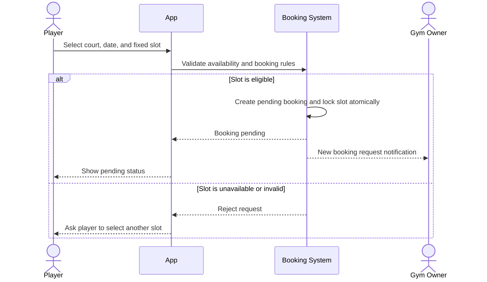
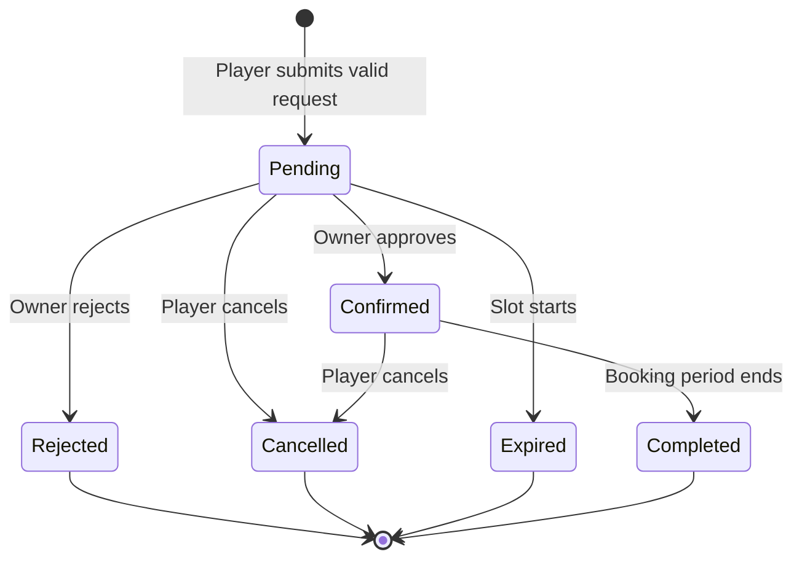

# Booking Flow

## Purpose

Define the MVP booking lifecycle from slot selection through owner action, expiry, cancellation, and completion.

## Create a booking request

## Booking state model

## State behavior

| State | Allowed action | Slot status | Required notification |
|---|---|---|---|
| `pending` | Owner approves/rejects; player cancels | Locked | Notify owner of new request |
| `confirmed` | Player cancels | Unavailable | Notify player of confirmation |
| `rejected` | None | Released | Notify player of rejection |
| `cancelled` | None | Released | Notify owner of player cancellation |
| `expired` | None | Released | Notify player of expiry |
| `completed` | None | Remains historical | Optional reminder before the booking; no completion notification required for MVP |

## Validation rules

- A request identifies exactly one player, venue, court, date, and fixed time slot.
- The player must be authenticated.
- The selected slot must not have started.
- The date must be inside the venue's configured booking advance window.
- The court must belong to the selected venue.
- Only one active booking may hold a court/date/slot combination.
- Availability validation and creation of the `pending` booking must be atomic.
- Owners may act only on bookings for venues they manage and only while the booking is `pending`.

## Payment

After a booking is confirmed, the player pays directly at the venue. The MVP has no payment gateway, deposits, refunds, or payment confirmation in the application.

## Failure and edge cases

| Situation | Expected outcome |
|---|---|
| Two players submit for the same slot | Only one request succeeds; the other receives an unavailable response. |
| Owner acts after the slot starts | The booking is `expired`; approval and rejection fail. |
| Owner repeats an action | The first valid transition wins; subsequent actions fail without changing the booking. |
| Player cancels a pending or confirmed booking | Set `cancelled`, release the slot, and notify the owner. |
| Player tries to cancel a terminal booking | Reject the action without changing the booking. |
