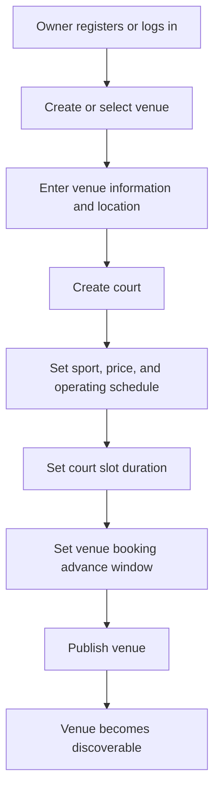
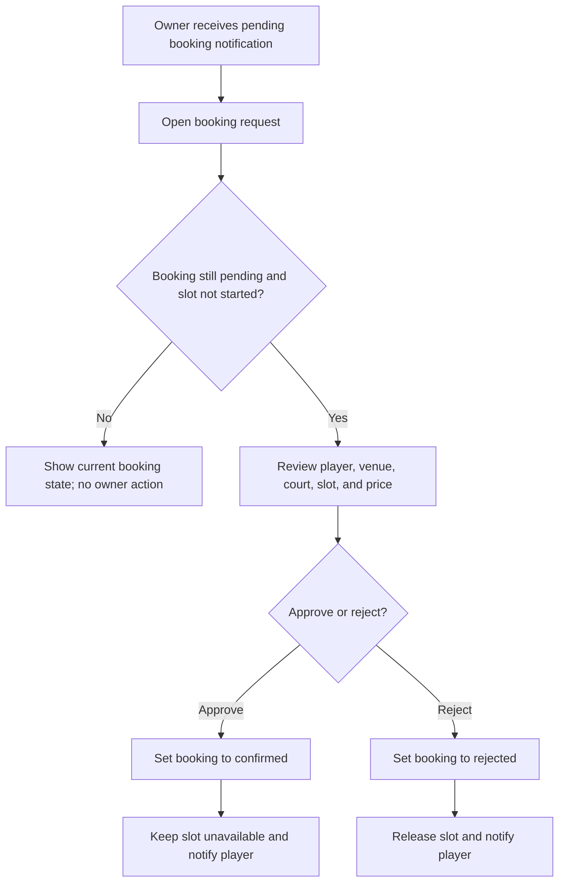

# Gym Owner Booking Management Flow

## Purpose

Define how a gym owner manages their venues, courts, availability, and pending booking requests.

## Venue and court setup

## Booking review

## Rules

- An owner may manage multiple venues; each venue may contain multiple courts.
- Each court has its own sport, price, operating schedule, and slot duration.
- The booking advance window belongs to the venue and applies to all of its courts.
- Owners see and act only on bookings associated with venues they manage.
- An owner can approve or reject only `pending` bookings.
- An owner cannot cancel a `confirmed` booking in the MVP.
- A booking that reaches its slot start while still pending becomes `expired`; it cannot be approved or rejected.

## Booking views

| View | Booking states |
|---|---|
| Action required | `pending` |
| Upcoming | `confirmed` |
| History | `completed`, `cancelled`, `rejected`, `expired` |

## Alternate outcomes

| Situation | Expected outcome |
|---|---|
| Venue lacks required information | Keep it unpublished and unavailable in player discovery. |
| Owner changes court duration or schedule | Regenerate future availability according to the updated configuration; never invalidate an existing confirmed booking without an explicit future policy. |
| Booking is no longer pending | Display its current status and hide approval/rejection actions. |
| Player cancels | Release the slot and notify the owner. |
