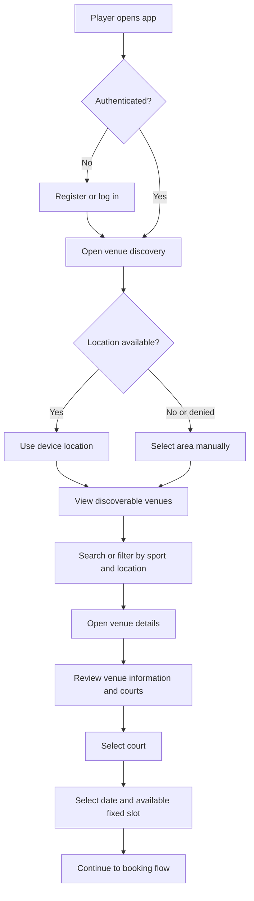

# Player Discovery Flow

## Purpose

Define how an authenticated player finds a suitable sports venue and reaches an available court slot.

## Primary flow

## Rules

- Players must be authenticated before accessing venue discovery.
- Device location is optional; manual area selection must be available.
- Only published, discoverable venues appear in results.
- Players can search venues and filter by sport and location.
- Venue details must show enough information to make a booking decision: location, supported sports, courts, pricing, operating information, and available slots.
- A player can only continue with a slot that has not started and is within the venue's booking advance window.

## Alternate outcomes

| Situation | Expected outcome |
|---|---|
| No location permission | Prompt the player to choose an area manually. |
| No venues match | Show an empty state and allow changing the location or filters. |
| Venue has no eligible slots | Show venue details but mark the selected court/date as unavailable. |
| Slot becomes unavailable | Prevent booking and ask the player to choose another slot. |

## Handoff

Selecting an eligible fixed slot starts the [booking flow](booking.md).
