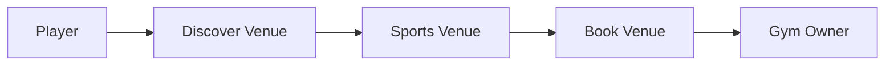
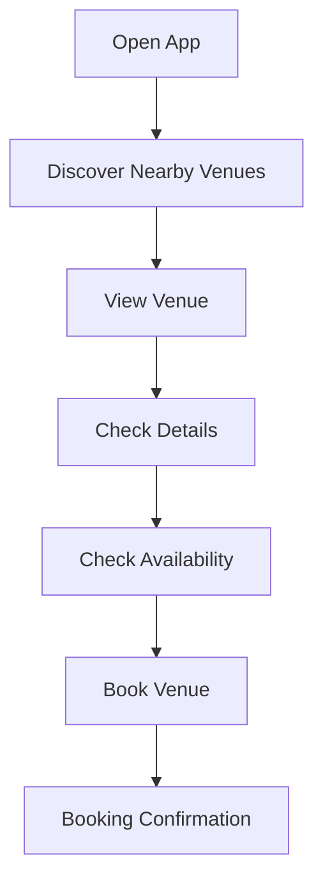
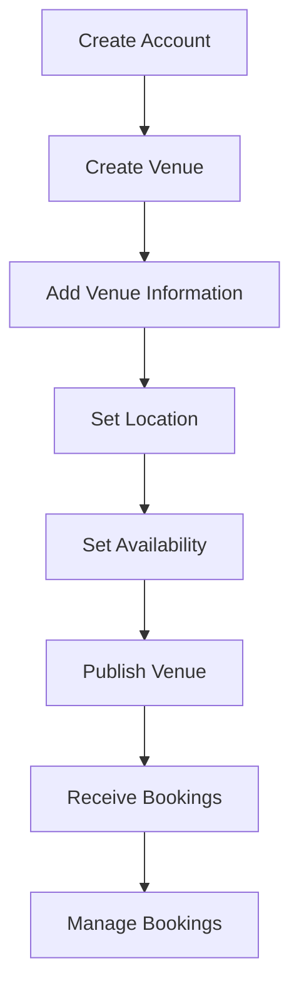
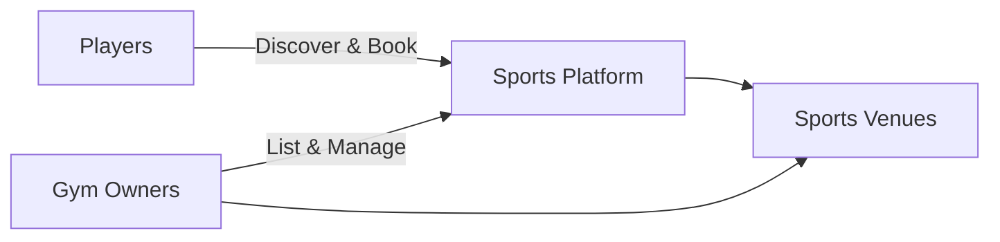

# Product Discovery

## 1. Product Idea

A community sports platform that connects players with nearby sports venues and gym owners.

Players should be able to discover sports venues in their area, view relevant information about them, and book available courts or facilities.

Gym owners should be able to list and promote their venues so that more players can discover and book them.

---

## 2. Problem

### For Players

Finding an available sports venue can be inconvenient.

Players may need to:

- Search through social media.
- Ask friends or local communities.
- Contact venues individually.
- Check availability manually.
- Search across multiple platforms.

The application should provide a simpler way to discover nearby venues and eventually book them.

### For Gym Owners

Gym owners need a way to increase the visibility and utilization of their venues.

They may currently rely on:

- Facebook pages or groups.
- Word of mouth.
- Direct messages.
- Phone calls.
- Walk-in customers.
- Other manual booking processes.

The application should help venues become easier to discover by local players.

---

## 3. Target Users

There are two primary user groups.

### Player

A person looking for a sports venue or court.

A player should eventually be able to:

- Discover nearby venues.
- Search and filter venues.
- View venue information.
- View location on a map.
- Check availability.
- Book a venue.
- Communicate with venue owners.
- Receive booking notifications.

### Gym Owner

A person or organization managing one or more sports venues.

A gym owner should eventually be able to:

- Create a venue listing.
- Provide venue information.
- Add supported sports and facilities.
- Add venue photos.
- Set location.
- Manage availability.
- Receive booking requests.
- Manage bookings.
- Communicate with players.
- Promote their venue.

---

## 4. Core Value Proposition

### For Players

> Find and book nearby sports venues more easily.

### For Gym Owners

> Make sports venues easier to discover and increase potential bookings.

---

## 5. Primary Product Goal

Create a marketplace/community where players looking for a place to play can discover and connect with available sports venues in their area.

The primary interaction is:



---

## 6. Core User Journey

The initial player journey is expected to look approximately like this:



The initial gym-owner journey is expected to look approximately like this:



These are discovery-stage flows and are expected to change as requirements become clearer.

---

## 7. Possible Features

The following features have been identified but are **not yet confirmed as MVP requirements**.

### Accounts

- Registration
- Login
- Authentication
- Account recovery

### Profiles

Player profiles may contain information such as:

- Name
- Profile photo
- Sports interests

Gym-owner profiles may contain:

- Owner information
- Managed venues
- Contact information

### Venue Discovery

Potential capabilities:

- Nearby venues
- Search
- Sports filtering
- Location filtering
- Venue details
- Map view

### Venue Management

Potential capabilities:

- Create venue
- Edit venue
- Venue photos
- Description
- Address/location
- Supported sports
- Amenities
- Pricing
- Operating hours

### Booking

Potential capabilities:

- Venue availability
- Time-slot selection
- Booking request
- Booking confirmation
- Booking cancellation
- Booking history

### Maps

Potential uses:

- Show nearby venues.
- Display venue locations.
- Search based on player location.
- Navigate toward a venue.

### Notifications

Potential notifications:

- Booking confirmed
- Booking cancelled
- New booking request
- Booking reminder
- Chat message

### Chat

Potential communication between:

```text
Player ↔ Gym Owner
```

Chat requirements should only be defined after determining whether direct communication is actually necessary for the booking workflow.

---

## 8. Product Model

The initial concept resembles a two-sided marketplace:



The platform needs to provide value to both sides.

Without venues, players have nothing useful to discover.

Without players, gym owners have little incentive to maintain listings.

This marketplace dynamic should be considered when defining the launch strategy.

---

## 9. Initial MVP Hypothesis

The MVP should prove the core interaction:

> Can players discover relevant nearby sports venues and successfully make a booking through the platform?

A possible MVP scope is therefore:

### Player

- Create account
- Login
- Discover venues
- Search/filter venues
- View venue details
- View venue location
- View available schedules
- Book a venue
- View bookings
- Receive essential booking notifications

### Gym Owner

- Create account
- Create venue
- Edit venue
- Set venue location
- Set pricing
- Set operating schedule/availability
- View booking requests
- Accept/manage bookings

Features such as social/community functionality, advanced chat, recommendations, ratings, tournaments, teams, and other extensions should not automatically enter the MVP.

They should only be added when they support a validated product requirement.

---

## 10. Platform

The backend/API is currently confirmed as part of the system.

The client application platform still needs to be formally decided.

Possible clients may include:

- Mobile application
- Web application
- Gym-owner dashboard

This decision should be made before creating the system architecture specification.

---

## 11. AI Usage

AI is currently intended for **development and project operations**, rather than being a customer-facing feature.

Potential uses include:

- Generating and maintaining documentation.
- Creating implementation plans from specifications.
- Reviewing specifications against implementation.
- Updating Mermaid diagrams.
- Assisting with code implementation.
- Generating tests.
- Reviewing pull requests.
- Checking acceptance criteria.
- Automating repetitive development tasks.

AI functionality should therefore not currently appear as a user-facing product requirement.

---

## 12. Open Questions

The following questions need to be resolved before the MVP specification is finalized.

### Venue Model

- What kinds of venues are supported?
- Is the platform initially focused on basketball courts, or multiple sports?
- Can one gym have multiple courts?
- Can one venue support multiple sports?

### Booking Model

- Is booking immediately confirmed or approved by the owner?
- Is availability managed directly in the platform?
- Can players cancel?
- Can owners cancel?
- Are recurring bookings supported?

### Payments

- Will players pay through the application?
- Will players pay at the venue?
- Does the platform collect commissions?
- Are deposits required?

### Location

- How far should "nearby" mean?
- Can players manually select another location?
- Is GPS permission required?

### Gym Owners

- Can one owner manage multiple venues?
- Can multiple employees manage the same venue?
- Does a venue need verification?

### Players

- Is an account required before browsing?
- Is an account required only when booking?
- Does a player need a public profile?

### Communication

- Is chat required for the initial booking experience?
- Could booking notes/contact information solve the initial need without implementing full real-time chat?

### Reviews

- Can players review venues?
- Is this required for MVP or a later version?

---

## 13. Current Product Statement

The current working product statement is:

> A sports venue discovery and booking platform that helps players find nearby places to play while helping gym owners make their venues easier to discover and book.

This statement is provisional and should evolve as the product requirements become clearer.
