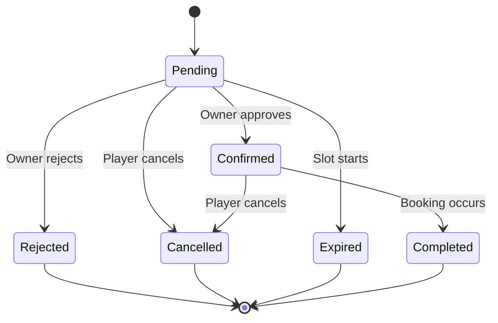
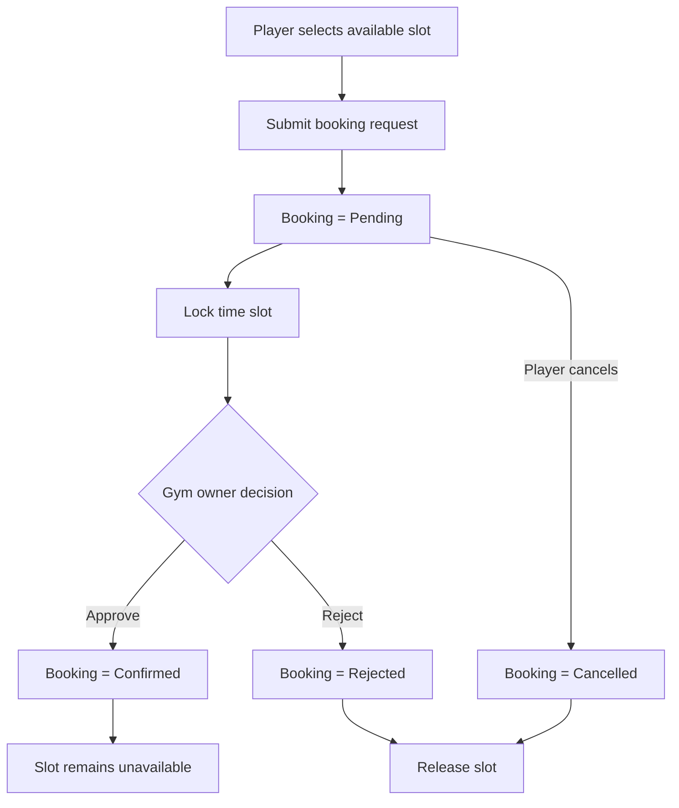
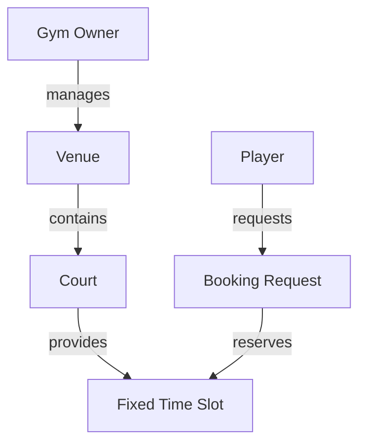

# Product Requirements

## 1. Purpose

This document defines the initial functional requirements for the sports venue discovery and booking platform.

These requirements represent the current MVP direction and should be used as the source of truth for:

- User flows
- Feature specifications
- Backend/API design
- Database design
- Client implementation
- Testing
- AI-assisted development

---

## 2. User Roles

The system has two primary user roles.

### Player

A player uses the application to:

- Discover nearby sports venues.
- View available courts.
- Check available time slots.
- Submit booking requests.
- Track booking status.
- Cancel bookings.

### Gym Owner

A gym owner uses the application to:

- Manage one or more venues.
- Manage one or more courts within each venue.
- Define supported sports.
- Define bookable time slots.
- Receive booking requests.
- Approve or reject booking requests.

---

# 3. Account Requirements

## AUTH-001 — Player Registration

A player must be able to create an account.

### Acceptance Criteria

- A player can register successfully.
- A unique account is created.
- The player can authenticate after registration.

---

## AUTH-002 — Gym Owner Registration

A gym owner must be able to create an account.

### Acceptance Criteria

- A gym owner can register successfully.
- A unique gym-owner account is created.
- The owner can authenticate after registration.

---

## AUTH-003 — Login

Registered users must be able to log in.

### Acceptance Criteria

- Valid credentials authenticate the user.
- Invalid credentials do not authenticate the user.
- The authenticated user's role is available to the application.

---

## AUTH-004 — Authentication Required for Venue Discovery

Players must be authenticated before browsing nearby venues.

### Acceptance Criteria

- Unauthenticated users cannot access venue discovery.
- Authenticated players can access venue discovery.
- Unauthenticated users are directed to authentication.

---

## AUTH-005 — Session Persistence

The application should preserve an authenticated session until the session expires or the user logs out.

---

# 4. Player Profile Requirements

## PLAYER-001 — Player Profile

A player must have a profile associated with their account.

The initial profile should support basic information required by the application.

Possible fields include:

- Name
- Profile image

Additional profile fields should only be added when required.

---

# 5. Gym Owner Requirements

## OWNER-001 — Gym Owner Profile

A gym owner must have a profile associated with their account.

The profile represents the individual or organization responsible for managing venues.

---

## OWNER-002 — Multiple Venues

A gym owner may manage multiple venues.

Example:

```text
Owner
├── Venue A
├── Venue B
└── Venue C
```

### Acceptance Criteria

- An owner can create more than one venue.
- Each venue remains independently manageable.
- Bookings are associated with the correct venue.

---

# 6. Venue Requirements

## VENUE-001 — Create Venue

A gym owner must be able to create a venue.

A venue should contain enough information for players to determine whether it is suitable.

Initial venue information may include:

- Venue name
- Description
- Address
- Geographic location
- Photos
- Operating hours
- Contact information
- Supported sports

---

## VENUE-002 — Edit Venue

A gym owner must be able to update venue information.

---

## VENUE-003 — Venue Location

Every published venue must have a location.

The location should be usable for nearby venue discovery.

---

## VENUE-004 — Supported Sports

A venue may support one or more sports.

Examples:

- Basketball
- Badminton
- Volleyball
- Tennis
- Futsal

The supported sports are determined by the gym owner based on what the venue provides for rent.

### Acceptance Criteria

- An owner can specify one or more supported sports.
- Players can identify which sports a venue supports.
- Venue discovery can use supported sports as filtering criteria.

---

## VENUE-005 — Venue Publication

Only venues that satisfy the minimum required information should be discoverable by players.

---

# 7. Court Requirements

## COURT-001 — Multiple Courts

A venue may contain one or more courts.

Example:

```text
Venue
├── Court 1
├── Court 2
└── Court 3
```

---

## COURT-002 — Court Information

Each court should contain information necessary for booking.

Possible information includes:

- Court name or number
- Supported sport
- Price
- Availability

---

## COURT-003 — Different Sports per Court

Courts within the same venue may support different sports.

Example:

```text
Sports Center
├── Court A — Basketball
├── Court B — Basketball
├── Court C — Badminton
└── Court D — Volleyball
```

---

## COURT-004 — Court Ownership

Every court must belong to exactly one venue.

---

# 8. Venue Discovery Requirements

## DISC-001 — Nearby Venue Discovery

An authenticated player must be able to discover venues available in their area.

### Acceptance Criteria

- The system can use the player's location or selected area.
- Relevant nearby venues are returned.
- Only discoverable venues are shown.

---

## DISC-002 — Venue List

Players must be able to browse available venues.

Each result should provide enough information to decide whether to view the venue details.

---

## DISC-003 — Venue Details

A player must be able to open a venue and view detailed information.

Venue details should include relevant information such as:

- Name
- Description
- Location
- Photos
- Supported sports
- Available courts
- Pricing

---

## DISC-004 — Map View

Players should be able to view venue locations on a map.

---

## DISC-005 — Search

Players should be able to search for venues.

---

## DISC-006 — Sport Filtering

Players should be able to filter venues based on supported sports.

---

## DISC-007 — Location Filtering

Players should be able to narrow venue discovery based on location.

---

# 9. Time Slot Requirements

## SLOT-001 — Fixed Time Slots

Courts must use fixed bookable time slots.

Examples:

```text
08:00–09:00
09:00–10:00
10:00–11:00
```

Players cannot initially specify arbitrary start and end times.

---

## SLOT-002 — Owner-Managed Slots

Gym owners must control which time slots are available for each court.

---

## SLOT-003 — Court-Specific Availability

Availability must be associated with a specific court.

Example:

```text
Venue A
└── Court 1
    ├── 08:00–09:00
    ├── 09:00–10:00
    └── 10:00–11:00
```

---

## SLOT-004 — Unavailable Slots

Players must not be able to request a slot that is unavailable.

---

## SLOT-005 — Configurable Slot Duration Per Court

A gym owner must be able to configure the booking slot duration for each court.

Different courts may use different slot durations.

Examples:

```text
Court A → 60 minutes
Court B → 90 minutes
Court C → 120 minutes
```

### Acceptance Criteria

- Each court has its own configured slot duration.
- Gym owners can define the duration when creating or editing a court.
- Available fixed slots are generated from the court's operating schedule and configured duration.
- Changing one court's duration does not affect other courts.

---

# 10. Booking Requirements

## BOOK-001 — Create Booking Request

A player must be able to request an available court time slot.

A booking request must identify at least:

- Player
- Venue
- Court
- Date
- Time slot

---

## BOOK-002 — Initial Booking Status

A newly submitted booking request must have the status:

```text
pending
```

---

## BOOK-003 — Owner Booking Requests

The gym owner must be able to view pending booking requests for venues they manage.

---

## BOOK-004 — Approve Booking

A gym owner must be able to approve a pending booking request.

The state transition is:

```text
pending → confirmed
```

---

## BOOK-005 — Reject Booking

A gym owner must be able to reject a pending booking request.

The state transition is:

```text
pending → rejected
```

---

## BOOK-006 — Player Cancellation

A player must be able to cancel their own booking.

Currently supported transitions are:

```text
pending → cancelled
```

and:

```text
confirmed → cancelled
```

This is an MVP rule and may change in future versions.

---

## BOOK-007 — Confirmed Booking Owner Restriction

A gym owner must not be able to cancel a confirmed booking.

Once the owner approves a booking, the booking is considered committed from the owner's side.

---

## BOOK-008 — Booking Completion

A confirmed booking should eventually transition to:

```text
completed
```

after the scheduled booking has taken place.

---

## BOOK-009 — Booking History

Players must be able to view their bookings and their statuses.

Gym owners must be able to view bookings associated with venues they manage.

---

# 11. Booking State Model

The initial booking states are:

```text
pending
confirmed
rejected
cancelled
expired
completed
```

The valid transitions are:



---

# 12. Booking Conflict Requirements

## BOOK-010 — Prevent Conflicting Confirmed Bookings

The system must prevent multiple confirmed bookings for the same court and time slot.

---

## BOOK-011 — Pending Booking Locks Slot

When a player submits a booking request for an available court time slot, that slot must become temporarily unavailable to other players.

The slot remains locked while the booking status is `pending`.

### State behavior

pending → confirmed

- Slot remains unavailable.

pending → rejected

- Slot becomes available again.

pending → cancelled

- Slot becomes available again.

### Acceptance Criteria

- Only one active pending booking can exist for a specific court, date, and time slot.
- Other players cannot submit a booking request for a locked slot.
- A rejected booking releases the slot.
- A cancelled pending booking releases the slot.
- A confirmed booking keeps the slot unavailable.



---

## BOOK-012 — Configurable Booking Advance Window

A gym owner must be able to configure how many days in advance players may request a booking for each venue.

### Acceptance Criteria

- The advance window is configured per venue, not per court.
- Players cannot request slots beyond the venue's configured window.
- Courts within a venue share that venue's advance window.
- Changing one venue's advance window does not affect another venue.

---

## BOOK-013 — Same-Day Booking

A player may request a booking on the current day when the selected slot has not started, is available, and is within the venue's advance window.

---

## BOOK-014 — Automatic Pending Booking Expiry

A pending booking request must automatically expire when its selected slot starts.

```text
pending → expired
```

When a booking expires, the system releases the slot, prevents further owner action, and notifies the player.

### Acceptance Criteria

- A pending booking cannot remain active after its slot starts.
- An expired booking cannot be approved or rejected.
- Expiry releases the slot for future availability calculations.
- The player can see that their booking expired.

---

# 13. Payment Requirements

## PAY-001 — Payment at Venue

Payment must occur directly at the venue.

The application does not process the payment.

---

## PAY-002 — No Online Payment Processing

The MVP must not require:

- Payment gateway integration
- Online card payments
- Deposits
- Refund processing
- Platform commissions

---

## PAY-003 — Pricing Visibility

Players should be able to see the price associated with a court or bookable time slot before submitting a booking request.

---

# 14. Notification Requirements

## NOTIF-001 — New Booking Request

A gym owner should receive a notification when a player submits a booking request.

---

## NOTIF-002 — Booking Confirmation

A player should receive a notification when the gym owner approves their booking.

---

## NOTIF-003 — Booking Rejection

A player should receive a notification when the gym owner rejects their booking.

---

## NOTIF-004 — Booking Cancellation

Relevant parties should be notified when a player cancels a booking.

---

## NOTIF-005 — Booking Reminder

The system may send a reminder before a confirmed booking.

The exact reminder timing is not yet defined.

---

# 15. Chat Requirements

Real-time chat is not part of the current MVP.

The system should not require chat in order to complete the primary booking flow.

Chat may be considered after the core application has been established.

---

# 16. AI Requirements

AI is not currently part of the customer-facing application.

AI may be used externally for:

- Documentation
- Implementation planning
- Code assistance
- Testing
- Documentation synchronization
- Development automation

These capabilities should not affect the MVP user experience.

---

# 17. Core Domain Relationship

The current conceptual hierarchy is:



Conceptually:

```text
Gym Owner
    │
    ├── Venue A
    │     ├── Court A1
    │     │      └── Time Slots
    │     └── Court A2
    │            └── Time Slots
    │
    └── Venue B
          └── Court B1
                 └── Time Slots
```

---

# 18. MVP Exclusions

The following are explicitly excluded from the current MVP:

- Online payments
- Deposits
- Refund management
- Platform commissions
- Player-to-owner chat
- Teams
- Matchmaking
- Tournaments
- Social feeds
- Advanced recommendations
- AI features for players
- Complex cancellation penalties
- Dynamic pricing
- Recurring bookings

---

# 19. Resolved MVP Decisions

- Only one active booking may hold a given court, date, and fixed time slot.
- Slot duration is configurable per court.
- Booking advance windows are configurable per venue.
- Same-day booking is allowed for slots that have not started.
- Pending bookings expire at their selected slot's start time.
- Device location is optional; players can choose an area manually.

---

# 20. Requirement Status

**Status:** Draft

Requirements in this document describe the current MVP direction.

Changes to established business rules should update this document before or together with implementation changes.
