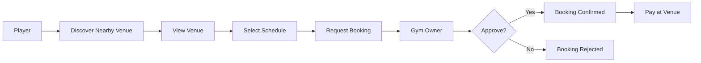
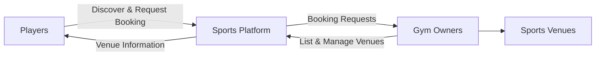
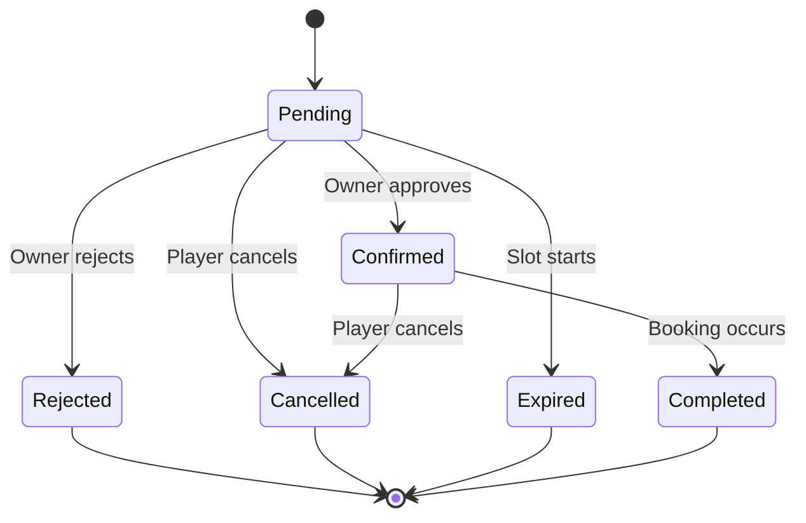

# Product Vision

## 1. Vision Statement

Build a community sports platform where players can easily discover and request bookings at nearby sports venues, while gym owners can increase their venue visibility and manage incoming booking requests through a simple platform.

The product should make finding a place to play more convenient for players and help gym owners attract more customers.

---

## 2. Problem Statement

### Players

Players who want to play a sport may have difficulty finding suitable venues nearby.

Current methods may include:

- Searching Facebook pages or groups.
- Asking friends or local communities.
- Messaging venues individually.
- Calling venues to ask about availability.
- Visiting venues without knowing if a court is available.

This creates unnecessary friction between deciding to play and actually finding an available venue.

### Gym Owners

Gym owners need a way to make their venues more visible to potential players.

They may currently depend on:

- Word of mouth.
- Social media posts.
- Facebook pages.
- Direct messages.
- Phone calls.
- Walk-in customers.

These methods can make venue discovery and booking difficult to manage consistently.

---

## 3. Target Users

The application has two primary user groups.

### Players

People looking for nearby sports venues where they can play.

Players primarily need to:

- Discover venues nearby.
- Find venues for a specific sport.
- View venue information.
- Check available schedules.
- Request a booking.
- Track the status of their booking.

### Gym Owners

Individuals or organizations that own or manage sports venues.

Gym owners primarily need to:

- List their venues.
- Provide accurate venue information.
- Manage venue availability.
- Receive booking requests.
- Approve or reject booking requests.
- Increase venue visibility to nearby players.

---

## 4. Value Proposition

### For Players

> Find nearby sports venues and request a booking without having to manually search and contact multiple venues.

### For Gym Owners

> Make your venue easier for local players to discover and provide a simple way to manage booking requests.

---

## 5. Primary Product Goal

The primary goal of the application is to connect players looking for a place to play with gym owners that have venues available for booking.

The core product interaction is:



---

## 6. Core Product Experience

The product should make the following experience straightforward:

### Player

```text
Discover
    ↓
Evaluate
    ↓
Request Booking
    ↓
Wait for Approval
    ↓
Receive Confirmation
    ↓
Play
    ↓
Pay at Venue
```

### Gym Owner

```text
List Venue
    ↓
Provide Availability
    ↓
Become Discoverable
    ↓
Receive Booking Request
    ↓
Approve or Reject
    ↓
Prepare for Confirmed Booking
```

The platform should reduce unnecessary communication where information can already be provided directly through the application.

---

## 7. Product Principles

### 7.1 Simple Discovery

Players should be able to find relevant venues with minimal effort.

Location, supported sports, availability, and important venue information should be easy to understand.

### 7.2 Accurate Venue Information

Venue information should be reliable enough for players to decide whether a venue fits their needs.

Gym owners should be responsible for keeping information such as schedules and venue details updated.

### 7.3 Low-Friction Booking

Requesting a booking should require only the information necessary to create a valid booking request.

The application should avoid unnecessary steps.

### 7.4 Clear Booking Status

Players and gym owners should always understand the current state of a booking.

For the MVP, the primary booking states are:

```text
pending
confirmed
rejected
cancelled
expired
completed
```

### 7.5 Owner-Controlled Availability

Gym owners control when their venues are available for booking.

Players should request bookings only from available schedules presented by the system.

### 7.6 Predictable Booking Commitments

Once a gym owner approves a booking and it becomes `confirmed`, the gym owner cannot cancel it under the current MVP rules.

This provides players with confidence that an approved booking will remain valid.

### 7.7 Build Only What Supports the Core Experience

The initial product should focus on venue discovery and booking.

Features should not be added to the MVP unless they directly support the primary player or gym-owner journey.

---

## 8. MVP Product Model

The initial application operates as a two-sided marketplace.



Both sides must receive meaningful value:

- Players need useful venues to discover.
- Gym owners need potential players and bookings.
- The platform connects the two sides.

---

## 9. MVP Scope

The MVP should validate whether players will use the platform to discover venues and successfully request bookings.

### Included

#### Accounts

- Player account.
- Gym-owner account.
- Registration.
- Login.
- Authentication.

#### Profiles

- Basic player profile.
- Basic gym-owner profile.

#### Venue Management

- Create venue.
- Edit venue.
- Venue name.
- Description.
- Location.
- Supported sports.
- Photos.
- Basic facility information.
- Operating schedule.
- Availability.
- Pricing information.

#### Venue Discovery

- Browse venues.
- Find nearby venues.
- Search venues.
- Filter venues.
- View venue details.
- View venue location on a map.

#### Booking

- Select an available schedule.
- Submit booking request.
- Owner receives booking request.
- Owner approves booking.
- Owner rejects booking.
- Player cancels booking.
- View booking status.
- View booking history.

#### Notifications

Essential notifications such as:

- New booking request.
- Booking approved.
- Booking rejected.
- Booking cancelled.
- Booking reminder.

#### Payment

Payment happens directly at the venue.

The application does not process payments for the MVP.

---

## 10. Booking Rules

### Booking Creation

A player selects an available venue schedule and submits a booking request.

A new booking starts with:

```text
pending
```

### Owner Approval

The gym owner can:

```text
pending → confirmed
```

or:

```text
pending → rejected
```

### Player Cancellation

A player can currently cancel:

```text
pending → cancelled
```

or:

```text
confirmed → cancelled
```

This is an MVP rule and may change in future versions.

### Owner Cancellation

A gym owner cannot cancel a confirmed booking.

The owner can only reject the booking before confirmation.

### Completion

After the scheduled booking has occurred:

```text
confirmed → completed
```

### Automatic Expiry

A pending booking automatically expires when its selected slot starts:

```text
pending → expired
```

Expiry releases the slot and prevents the owner from approving or rejecting the request.

### Payment

Payment is completed directly between the player and the venue.

There is currently:

- No online payment.
- No payment gateway.
- No deposit.
- No refund processing.
- No platform commission processing.

---

## 11. Booking State Flow



---

## 12. Out of Scope for the Initial MVP

The following should not be treated as MVP requirements unless explicitly reconsidered.

### Payments

- Online payments.
- Deposits.
- Refunds.
- Platform commissions.
- Payment disputes.

### Advanced Booking Policies

- Cancellation penalties.
- Cancellation deadlines.
- Refund policies.
- No-show penalties.
- Dynamic pricing.
- Recurring reservations.

### Advanced Marketplace Features

- Paid venue promotion.
- Sponsored listings.
- Advanced recommendation algorithms.
- Loyalty programs.

### Community Features

Potential community functionality may be considered later, including:

- Teams.
- Player groups.
- Tournaments.
- Matchmaking.
- Public activity feeds.
- Community events.

The word "community" in the product vision should not automatically make these features part of the MVP.

### AI Product Features

AI is not currently a user-facing product feature.

---

## 13. AI and Development Automation

AI may be used to support development and documentation.

Potential uses include:

- Generate documentation from established specifications.
- Maintain Mermaid diagrams.
- Generate implementation plans.
- Assist with code implementation.
- Generate tests.
- Review code changes.
- Compare implementation against requirements.
- Identify outdated documentation.
- Assist with repetitive development tasks.

AI-generated changes should still use the project documentation as the source of truth.

---

## 14. Future Direction

The platform may eventually expand beyond basic venue discovery and booking.

Possible future areas include:

- Online payment.
- Deposits.
- Ratings and reviews.
- Venue verification.
- Advanced booking policies.
- Team creation.
- Sports communities.
- Player matchmaking.
- Tournaments and events.
- Promotions for gym owners.
- Venue analytics.
- Multiple venue staff accounts.
- Membership systems.

These are potential directions, not committed features.

Future development should be based on validated user needs rather than expanding the application simply because a feature is technically possible.

---

## 15. Product Success

For the initial product, success should primarily be measured by whether the platform creates successful connections between players and venues.

Important product outcomes include:

- Players can find relevant venues.
- Players successfully submit booking requests.
- Gym owners respond to booking requests.
- Booking requests become confirmed bookings.
- Players attend confirmed bookings.
- Gym owners receive additional bookings through the platform.

More specific KPIs should be established after the MVP requirements and expected user behavior are better defined.

---

## 16. Current Product Statement

> A community sports venue discovery and booking platform that helps players find nearby places to play and request bookings, while helping gym owners make their venues more discoverable and manage booking requests.

---

## 17. Vision Status

**Status:** Draft

This vision represents the current understanding of the product.

It should remain relatively stable, while implementation details, feature specifications, and MVP requirements may evolve as the product is developed and validated.
