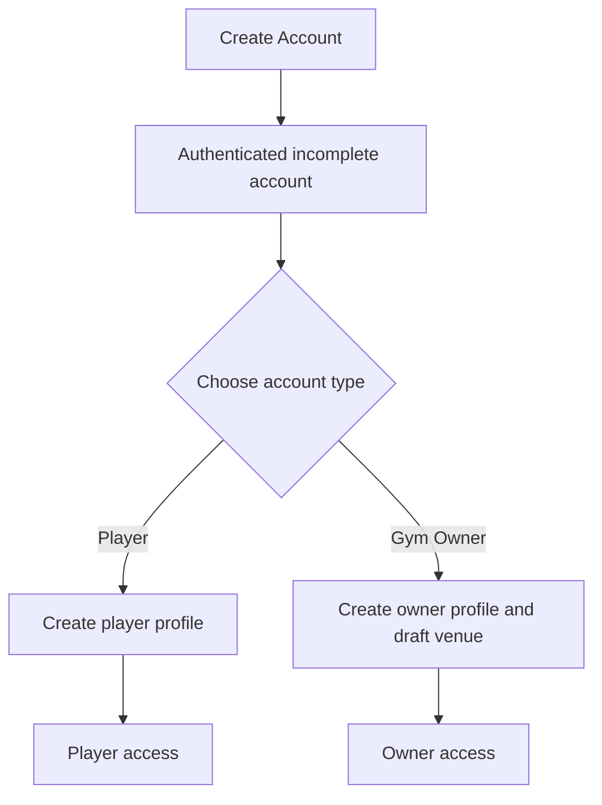
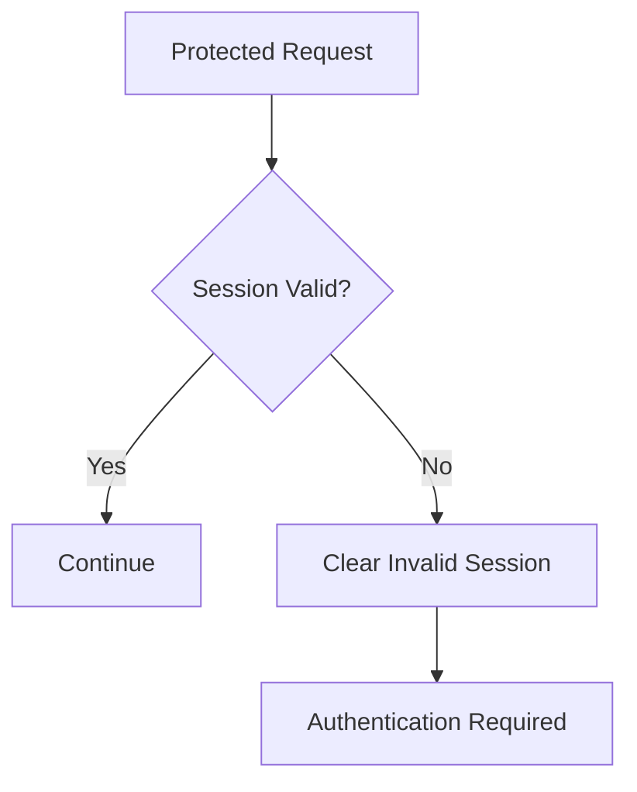
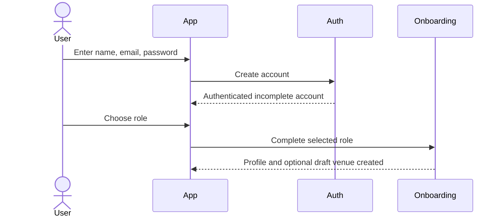
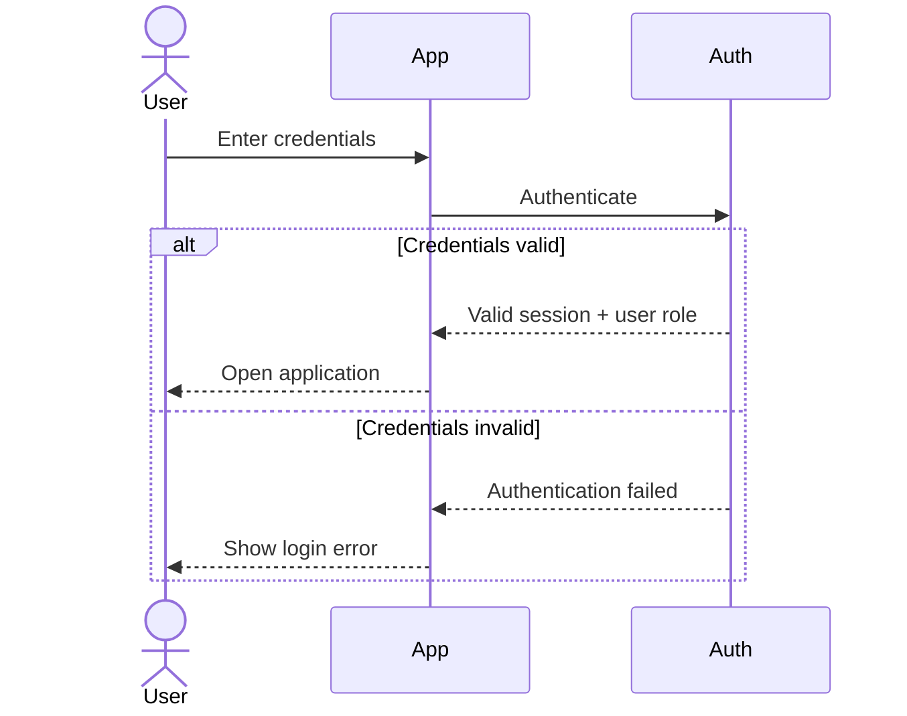
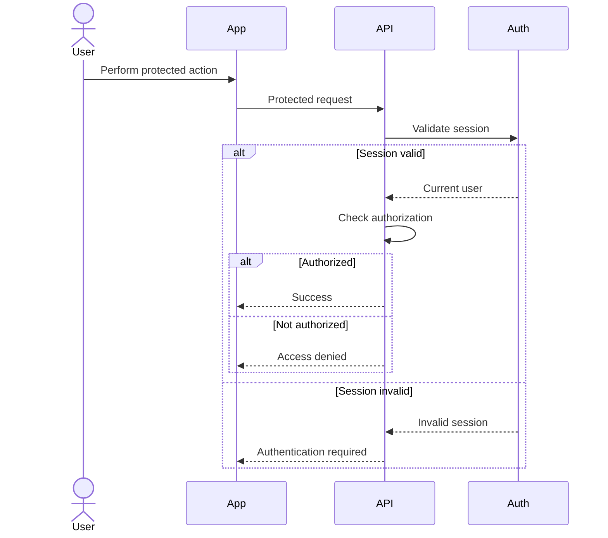
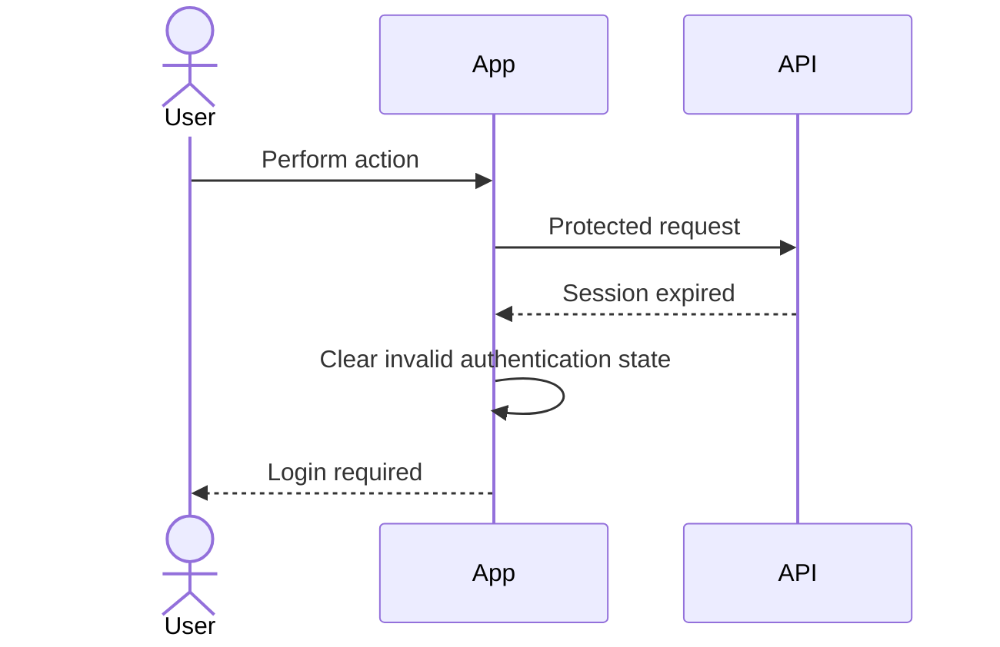

# Authentication Specification

## 1. Purpose

This document defines authentication and role behavior for the MVP.

It specifies:

- Player registration
- Gym-owner registration
- Login
- Logout
- Session persistence
- Role identification
- Protected access
- Authentication failures
- Authorization boundaries
- Basic account recovery expectations
- Acceptance criteria

This document describes product behavior only.

Token format, password hashing, OAuth providers, session storage, refresh-token strategy, middleware implementation, and API endpoints belong in architecture and API documentation.

---

# 2. Related Documents

This specification is derived from:

```text
docs/product/requirements.md
docs/product/mvp.md

docs/flows/player-discovery.md
docs/flows/booking.md
docs/flows/owner-booking-management.md

docs/specs/booking.md
docs/specs/venue-court-management.md
docs/specs/venue-discovery.md
```

---

# 3. User Roles

The MVP supports three account roles:

```text
admin
player
gym_owner
```

`player` is the default role. `admin` is a platform-operations role and is
never granted by public self-sign-up; it must be provisioned through a trusted
administrative path.

---

## Player

A player can:

- Maintain a basic player account.
- Access venue discovery.
- View venues and courts.
- View availability.
- Submit booking requests.
- View their own bookings.
- Cancel eligible bookings.

---

## Gym Owner

A gym owner can:

- Maintain a gym-owner account.
- Create venues.
- Manage venues.
- Manage courts.
- Configure availability.
- View venue bookings.
- Approve pending bookings.
- Reject pending bookings.

---

## Admin

An admin is a platform operator who may access explicitly admin-only
capabilities as those modules are delivered. Admin is not a venue-staff role
and does not automatically grant ownership of any venue. The MVP does not
define admin routes yet; provisioning and authorization must be added together
before an admin capability is exposed.

---

# 4. Account Role

## AUTH-SPEC-001 — Account Has Role

Every authenticated account must have an application role.

For MVP, every account has exactly one of:

```text
admin
```

or:

```text
player
```

or:

```text
gym_owner
```

The role determines which protected capabilities are available.

---

# 5. Registration and Onboarding

The MVP registers an account before the user chooses its application role.
Registration collects only name, email, and password. A successfully
authenticated account is directed to onboarding and cannot use product APIs
until it completes one role path.

Conceptually:



---

# 6. Player Registration

## AUTH-SPEC-002 — Player Onboarding

A new user must be able to register as a player.

Initial registration should collect only the minimum information required to establish the account.

Possible fields:

- Name
- Email
- Password

The exact identity fields may be finalized during API design.

---

## Player Registration Result

After successful player onboarding:

- A player account exists.
- The account role is `player`.
- A player profile can be associated with the account.
- The user may authenticate.

Whether the user is automatically authenticated immediately after registration may be decided during UX/API design.

---

# 7. Gym Owner Registration

## AUTH-SPEC-003 — Gym Owner Onboarding

A new user must be able to register as a gym owner.

The owner must provide the first venue draft during onboarding:

- Venue name
- Description
- Address
- Latitude and longitude
- Booking advance days

Photos, contact information, amenities, courts, and operating schedules remain
optional at this stage. The venue is created as a draft and cannot be published
until it satisfies the venue publication rules.

---

## Gym Owner Registration Result

After successful gym-owner onboarding:

- A gym-owner account exists.
- The account role is `gym_owner`.
- A gym-owner profile can be associated with the account.
- The owner can access venue-management capabilities after authentication.
- The first venue is an unpublished owner-owned draft.

---

# 8. Minimal Registration Principle

Registration should not require users to complete unrelated product setup.

For example, a gym owner should not need to create a venue as part of authentication.

Prefer:

```text
Register
   ↓
Account Created
   ↓
Choose role during onboarding
   ↓
Use the application
```

instead of:

```text
Register
   ↓
Enter Venue
   ↓
Enter Courts
   ↓
Configure Schedule
   ↓
Finally Create Account
```

Gym-owner onboarding may create a first venue draft because it is an explicit
owner setup step, not part of credential creation.

---

# 9. Unique Identity

## AUTH-SPEC-004 — Unique Login Identity

The identifier used for login must uniquely identify an account.

If email is used as the MVP login identifier:

- The same email must not create multiple independent accounts unless explicitly supported later.
- Registration should reject an already-used email.

The exact login identifier should be finalized before API implementation.

---

# 10. Login

## AUTH-SPEC-005 — Login

A registered user must be able to authenticate using valid credentials.

Conceptually:

```text
Credentials
    ↓
Validate
    ↓
Valid?
   /    \
 Yes     No
 ↓        ↓
Session  Error
```

---

# 11. Successful Login

When credentials are valid:

- Authentication succeeds.
- The current user can be identified.
- The user's role is available.
- The user can access role-appropriate functionality.

---

# 12. Invalid Login

When credentials are invalid:

- Authentication must fail.
- No authenticated session is created.
- Protected data must not be returned.

The application should display a generic authentication failure.

Example:

```text
Email or password is incorrect.
```

Avoid unnecessarily revealing whether a specific account exists.

---

# 13. Session Persistence

## AUTH-SPEC-006 — Persistent Authentication

A valid authenticated session should persist across normal application restarts.

Example:

```text
Login
  ↓
Close app
  ↓
Open app
  ↓
Session still valid
  ↓
Continue authenticated
```

Users should not be required to log in every time they launch the application.

---

# 14. Session Validation

Stored authentication state must not automatically be trusted indefinitely.

When the application resumes or makes protected requests, the system must be able to determine whether the session is still valid.

---

# 15. Expired or Invalid Session

## AUTH-SPEC-007 — Session Expiry

If the user's session is expired or invalid:

- Protected actions must fail.
- Local authenticated state should be cleared when appropriate.
- The user should be directed back to authentication.
- The application should handle the condition gracefully.

Conceptually:



---

# 16. Logout

## AUTH-SPEC-008 — Logout

An authenticated user must be able to log out.

After logout:

- The authenticated session must no longer be usable.
- Protected local authentication state should be cleared.
- Protected application areas must require authentication again.

---

# 17. Protected Player Access

## AUTH-SPEC-009 — Player Discovery Protection

Venue discovery requires an authenticated player.

An unauthenticated request for protected discovery information must fail.

A gym-owner account should not automatically be treated as a player for player-only actions unless the product later supports dual-role behavior.

---

# 18. Protected Owner Access

## AUTH-SPEC-010 — Owner Management Protection

Venue and court management requires:

```text
role = gym_owner
```

A player must not be able to:

- Create a venue
- Edit a venue
- Create a court
- Modify availability
- Approve booking requests
- Reject booking requests

---

# 19. Resource Authorization

Authentication answers:

> Who is this user?

Authorization additionally answers:

> Is this user allowed to access this specific resource?

These must remain separate concepts.

---

# 20. Venue Ownership Authorization

## AUTH-SPEC-011 — Owner Venue Authorization

A gym owner may only modify venues they are authorized to manage.

Example:

```text
Owner A
└── Venue A

Owner B
└── Venue B
```

Owner A must not modify Venue B.

Being a `gym_owner` alone is insufficient.

---

# 21. Court Authorization

A gym owner may modify a court only when they are authorized for the court's parent venue.

Conceptually:

```text
User
 ↓
Gym Owner?
 ↓
Owns / manages Venue?
 ↓
Court belongs to Venue?
 ↓
Allow action
```

---

# 22. Booking Authorization — Player

## AUTH-SPEC-012 — Player Booking Ownership

A player may only:

- View protected booking details for their own bookings.
- Cancel their own eligible bookings.

Player A must not cancel Player B's booking.

---

# 23. Booking Authorization — Owner

## AUTH-SPEC-013 — Owner Booking Authorization

An owner may manage a booking only when:

```text
booking
  ↓
court
  ↓
venue
  ↓
authorized owner
```

This authorization must be validated before approval or rejection.

---

# 24. Role-Based Access Summary

| Capability                  | Admin | Player |                Gym Owner |
| --------------------------- | ----: | -----: | -----------------------: |
| Login                       |   Yes |    Yes |                      Yes |
| Logout                      |   Yes |    Yes |                      Yes |
| Browse nearby venues        |     — |    Yes |            No by default |
| View venue details          |     — |    Yes | Owner management context |
| Submit booking              |     — |    Yes |                       No |
| Cancel own booking          |     — |    Yes |                       No |
| Create venue                |     — |     No |                      Yes |
| Edit owned venue            |     — |     No |                      Yes |
| Create court                |     — |     No |                      Yes |
| Configure availability      |     — |     No |                      Yes |
| View managed venue bookings |     — |     No |                      Yes |
| Approve booking             |     — |     No |                      Yes |
| Reject booking              |     — |     No |                      Yes |

This represents MVP role behavior.

---

# 25. Dual Roles

The MVP does not currently require a single account to act as both:

```text
player
+
gym_owner
```

Supporting dual-role accounts would introduce additional navigation, permission, and onboarding behavior.

It should not be added without an explicit product requirement.

---

# 26. Account Recovery

## AUTH-SPEC-014 — Basic Account Recovery

Production authentication should provide a method for users to regain access if they forget their credentials.

For an email/password system, this may mean:

```text
Forgot Password
      ↓
Verify Account
      ↓
Reset Password
```

The exact recovery mechanism is not specified here.

---

# 27. Password Requirements

Password rules should provide reasonable security without unnecessary complexity.

The exact minimum length and password policy should be decided during authentication architecture.

The product specification should avoid prescribing implementation-specific password hashing or complexity algorithms.

---

# 28. Email Verification

Email verification is out of scope for this MVP. Production registration and
onboarding do not require a verified email. A future release may add:

```text
Register
  ↓
Verify email
  ↓
Full account access
```

This should be added only if required by security, abuse prevention, or product needs.

---

# 29. Account Status

The authentication architecture may need an account status such as:

```text
active
disabled
```

A disabled account must not authenticate or access protected resources.

Detailed moderation/account suspension behavior is outside the MVP.

---

# 30. Authentication Error Cases

Conceptual cases include:

```text
INVALID_CREDENTIALS
AUTHENTICATION_REQUIRED
SESSION_EXPIRED
ACCOUNT_DISABLED
EMAIL_ALREADY_EXISTS
INVALID_ACCOUNT_ROLE
UNAUTHORIZED_ACTION
RESOURCE_ACCESS_DENIED
```

These names do not define final API error codes.

---

# 31. Unauthorized vs Unauthenticated

These conditions should remain distinct.

## Unauthenticated

The system cannot establish a valid current user.

Example:

```text
No valid session
```

Expected result:

```text
Authentication required
```

---

## Unauthorized

The user is authenticated but does not have permission to perform the action.

Example:

```text
Player attempts to create venue
```

Expected result:

```text
Access denied
```

---

# 32. Registration Sequence



---

# 33. Login Sequence



---

# 34. Protected Request Sequence



---

# 35. Session Expiry Sequence



---

# 36. Authentication Invariants

## INV-AUTH-001

Every authenticated user has a valid account identity.

## INV-AUTH-002

Every MVP account has one recognized role: `admin`, `gym_owner`, or `player`.

## INV-AUTH-003

Unauthenticated users cannot access protected resources.

## INV-AUTH-004

Players cannot perform owner-only management actions.

## INV-AUTH-005

Gym owners cannot manage unrelated venues.

## INV-AUTH-006

Players cannot manage another player's bookings.

## INV-AUTH-007

A session marked invalid or expired must not continue authorizing protected actions.

## INV-AUTH-008

Logging out invalidates the user's authenticated application state.

## INV-AUTH-009

Public self-sign-up cannot grant the `admin` role.

---

# 37. Acceptance Criteria — Player Registration

- [ ] User registers with name, email, and password only.
- [ ] User can choose player during onboarding.
- [ ] Required registration data is validated.
- [ ] Duplicate login identity is rejected.
- [ ] Successful player onboarding receives `player` role.
- [ ] Incomplete accounts cannot use product APIs.

---

# 38. Acceptance Criteria — Gym Owner Registration

- [ ] User can choose gym owner during onboarding.
- [ ] Required registration data is validated.
- [ ] Duplicate login identity is rejected.
- [ ] Successful owner onboarding receives `gym_owner` role.
- [ ] Owner onboarding creates one unpublished first-venue draft.
- [ ] Owner can authenticate after successful registration.

---

# 39. Acceptance Criteria — Login

- [ ] Valid credentials authenticate.
- [ ] Invalid credentials do not authenticate.
- [ ] User role is available after authentication.
- [ ] Protected application state becomes accessible only after successful authentication.
- [ ] Login errors do not expose unnecessary account information.

---

# 40. Acceptance Criteria — Session

- [ ] Valid session persists across normal app restart.
- [ ] Protected requests can validate current authentication.
- [ ] Expired session cannot continue accessing protected resources.
- [ ] Invalid session returns user to authentication flow.
- [ ] Logout removes authenticated access.

---

# 41. Acceptance Criteria — Role Authorization

- [ ] Player cannot create venues.
- [ ] Player cannot modify courts.
- [ ] Player cannot approve bookings.
- [ ] Gym owner can access owner-management functionality.
- [ ] Gym owner cannot modify another owner's venue.
- [ ] Gym owner cannot approve bookings outside managed venues.
- [ ] Admin is not assignable through public self-sign-up.

---

# 42. Acceptance Criteria — Player Resource Authorization

- [ ] Player can view their own protected bookings.
- [ ] Player can cancel their own eligible booking.
- [ ] Player cannot cancel another player's booking.
- [ ] Player cannot access private owner-management information.

---

# 43. Out of Scope

The MVP authentication feature does not currently require:

- Social login
- Google login
- Apple login
- Facebook login
- Phone-number authentication
- OTP-only authentication
- Passkeys
- Biometric login
- Multi-factor authentication
- Organization SSO
- Multiple roles per account
- Venue staff accounts
- Permission groups
- Admin impersonation
- Public guest browsing

These may be introduced later through explicit requirements.

---

# 44. Open Specification Items

## OPEN-AUTH-001 — Login Identifier

Confirm whether MVP authentication uses:

```text
email + password
```

or another identifier.

Email/password is currently the simplest default but is not formally established yet.

---

---

## OPEN-AUTH-003 — Account Recovery

Define the actual recovery mechanism after the authentication technology is chosen.

---

## OPEN-AUTH-004 — Session Policy

Define:

- Session lifetime
- Refresh behavior
- Device/session revocation behavior

during architecture.

---

## OPEN-AUTH-005 — Owner Verification

Determine whether anyone may register as a gym owner immediately or whether venue/gym-owner verification will eventually be required.

Owner verification is not currently required for the MVP.

---

# 45. Specification Status

**Status:** Draft

Authentication and role boundaries are sufficiently defined to support the core MVP flows.

Implementation can later define the session/token mechanism while preserving the authorization rules established here.
