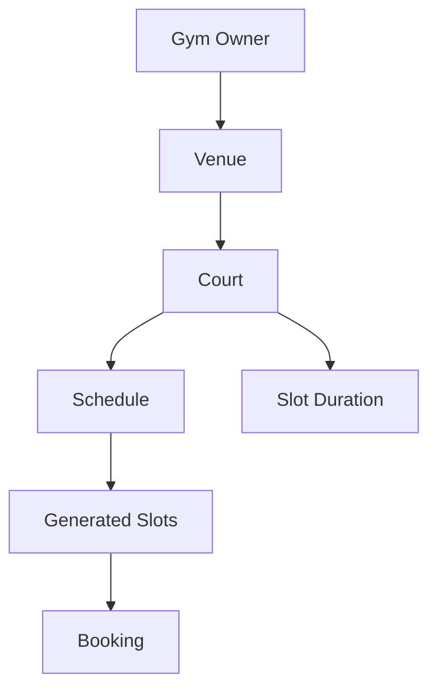
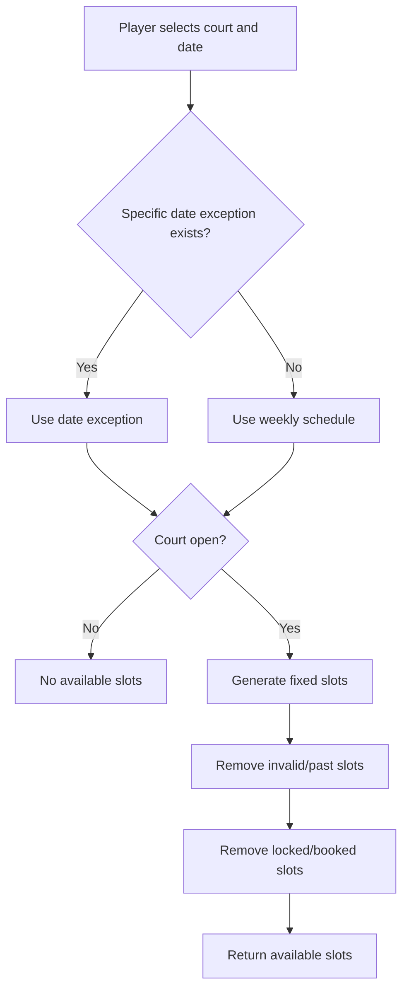
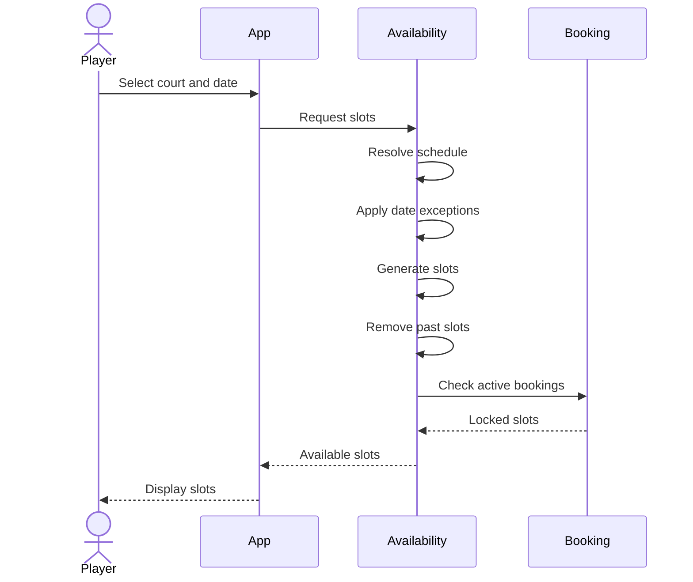
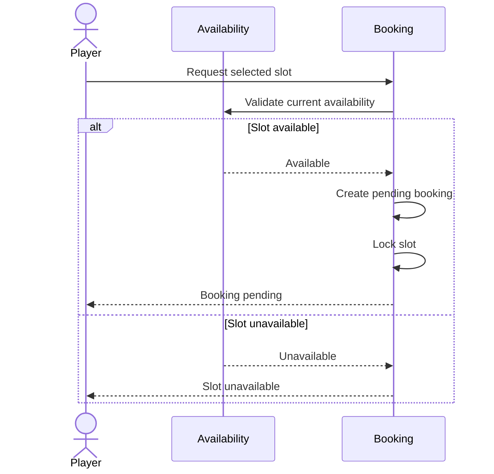

# Availability Feature Specification

## 1. Purpose

This document defines how court availability works for the MVP.

It specifies:

- Court operating schedules
- Configurable slot duration
- Fixed slot generation
- Weekly availability
- Closed days
- Date-specific exceptions
- Booking advance window interaction
- Same-day availability
- Booking slot locking
- Slot release behavior
- Availability validation
- Acceptance criteria

This document describes product behavior only.

Database schemas, recurrence implementation, caching, scheduling jobs, locking mechanisms, and API endpoints belong in architecture and API documentation.

---

# 2. Related Documents

This specification is derived from:

```text
docs/product/requirements.md
docs/product/mvp.md

docs/flows/booking.md
docs/flows/player-discovery.md
docs/flows/owner-booking-management.md

docs/specs/booking.md
```

---

# 3. Domain Relationship

Availability belongs primarily to a court.



Conceptually:

```text
Gym Owner
   └── Venue
       └── Court
           ├── Weekly Schedule
           ├── Slot Duration
           ├── Date Exceptions
           └── Generated Slots
```

---

# 4. Availability Principles

The MVP follows these rules:

1. Gym owners define when each court is available.
2. Each court has its own slot duration.
3. Players book generated fixed slots.
4. Players cannot create arbitrary start and end times.
5. Court availability may differ between days.
6. Specific dates may override the normal weekly schedule.
7. Pending bookings lock their selected slot.
8. Confirmed bookings keep their selected slot unavailable.
9. Rejected, cancelled, and expired bookings release their slot where applicable.

---

# 5. Court-Level Availability

## AVAIL-001 — Availability Belongs to Court

Availability must be configured per court.

Example:

```text
Venue A

Court 1
Monday:
08:00–17:00

Court 2
Monday:
10:00–22:00
```

Changing Court 1's availability must not affect Court 2.

---

# 6. Weekly Schedule

## AVAIL-002 — Weekly Court Schedule

A gym owner must be able to define the normal weekly operating schedule for each court.

Example:

```text
Court 1

Monday     08:00–20:00
Tuesday    08:00–20:00
Wednesday  08:00–20:00
Thursday   08:00–20:00
Friday     08:00–22:00
Saturday   06:00–22:00
Sunday     06:00–18:00
```

---

## Closed Days

A day may have no available schedule.

Example:

```text
Monday      08:00–20:00
Tuesday     08:00–20:00
Wednesday   Closed
Thursday    08:00–20:00
```

No bookable slots should be generated for a closed day.

---

# 7. Multiple Operating Periods

The availability model should support more than one operating period within the same day.

Example:

```text
Monday

08:00–12:00
14:00–20:00
```

This allows courts to support breaks or unavailable periods.

Generated slots must not cross the gap between operating periods.

---

# 8. Slot Duration

## AVAIL-003 — Configurable Slot Duration Per Court

Each court must have a configured booking slot duration.

Examples:

```text
Court A → 60 minutes
Court B → 90 minutes
Court C → 120 minutes
```

The duration applies to generated slots for that court.

---

## Slot Duration Validation

The duration must:

- Be greater than zero.
- Be valid for the court's operating schedule.
- Produce bookable time periods that do not extend beyond operating hours.

The allowed minimum and maximum durations may be established later.

---

# 9. Slot Generation

## AVAIL-004 — Generate Fixed Slots

Available booking slots are derived from:

```text
Court schedule
+
Slot duration
+
Selected date
+
Date exceptions
+
Existing bookings
```

Example:

```text
Operating period:
08:00–12:00

Slot duration:
60 minutes
```

Generated slots:

```text
08:00–09:00
09:00–10:00
10:00–11:00
11:00–12:00
```

---

# 10. Slot Generation With 90-Minute Duration

Example:

```text
Operating period:
08:00–14:00

Slot duration:
90 minutes
```

Generated slots:

```text
08:00–09:30
09:30–11:00
11:00–12:30
12:30–14:00
```

---

# 11. Incomplete Final Slot

A slot must not extend beyond the operating period.

Example:

```text
Operating period:
08:00–12:30

Slot duration:
60 minutes
```

Valid:

```text
08:00–09:00
09:00–10:00
10:00–11:00
11:00–12:00
```

Invalid:

```text
12:00–13:00
```

because it extends beyond closing time.

The remaining:

```text
12:00–12:30
```

does not automatically become a shorter slot.

---

# 12. Date-Specific Exceptions

## AVAIL-005 — Availability Exception

A gym owner must be able to override the normal weekly schedule for a specific date.

This is required for situations such as:

- Holidays
- Maintenance
- Private events
- Court repairs
- Special operating hours

---

# 13. Closed-Date Exception

Example:

```text
Normal Friday:
08:00–20:00

December 25:
Closed
```

No slots should be generated for December 25.

---

# 14. Modified-Hours Exception

An owner may define different hours for a specific date.

Example:

```text
Normal Friday:
08:00–20:00

December 24:
08:00–14:00
```

For that date, slot generation must use:

```text
08:00–14:00
```

instead of the normal Friday schedule.

---

# 15. Exception Priority

Date-specific availability must override the normal weekly schedule.

Conceptually:

```text
Specific date exception exists?
          ↓
        Yes
          ↓
Use exception schedule
```

Otherwise:

```text
Use normal weekly schedule
```

---

# 16. Availability Resolution



---

# 17. Booking Advance Window

## AVAIL-006 — Venue Booking Window

The venue defines how far into the future players may request bookings.

Example:

```text
Booking advance window:
14 days
```

A player may only view/request valid booking dates within that range.

The advance window is configured at venue level and applies to all courts under the venue.

---

# 18. Same-Day Availability

Same-day booking is allowed.

When viewing today's schedule, slots that have already started must not be bookable.

Example:

```text
Current time:
14:30

Slots:

13:00–14:00  unavailable
14:00–15:00  unavailable
15:00–16:00  available
16:00–17:00  available
```

The current slot:

```text
14:00–15:00
```

is considered unavailable because its start time has already passed.

---

# 19. Future Slot Availability

A future slot is eligible only when:

- The date is within the booking advance window.
- The court is open on that date.
- The slot fits completely inside an operating period.
- The slot has not been disabled by an exception.
- No active booking currently locks it.

---

# 20. Booking Lock Interaction

## AVAIL-007 — Pending Booking Locks Slot

When a player successfully creates a booking request:

```text
available
    ↓
pending booking created
    ↓
slot locked
```

The slot must no longer appear as available to other players.

---

# 21. Confirmed Booking

When:

```text
pending → confirmed
```

the slot remains unavailable.

---

# 22. Rejected Booking

When:

```text
pending → rejected
```

the slot becomes available again if:

- The slot has not started.
- The court is otherwise available.
- The date remains within the booking window.

---

# 23. Cancelled Booking

When:

```text
pending → cancelled
```

or:

```text
confirmed → cancelled
```

the slot becomes available again if it is still valid for future booking.

---

# 24. Expired Booking

When:

```text
pending → expired
```

the slot lock is released.

However, because expiry occurs when the slot begins, the slot should not become bookable again for that same period.

Conceptually:

```text
Lock released
≠
Slot necessarily bookable
```

This distinction is important.

Availability must still validate the slot's start time.

---

# 25. Completed Booking

Completed booking slots are historical.

They must never reappear as available because their date/time has already occurred.

---

# 26. Availability vs Booking State

| Booking State | Holds Lock | Future Slot Can Appear Available |
| ------------- | ---------: | -------------------------------: |
| `pending`     |        Yes |                               No |
| `confirmed`   |        Yes |                               No |
| `rejected`    |         No |                              Yes |
| `cancelled`   |         No |                              Yes |
| `expired`     |         No |       No if slot already started |
| `completed`   | Historical |                               No |

---

# 27. Availability Revalidation

## AVAIL-008 — Validate Again on Booking Submission

The availability displayed to a player must not be treated as guaranteed until the booking request is successfully created.

Example:

```text
10:00:00
Player A sees slot available.

10:00:01
Player B sees slot available.

10:00:03
Player A submits and locks slot.

10:00:05
Player B submits.
```

Player B's request must fail because the slot is no longer available.

---

# 28. Availability Display Is Informational

The UI may show:

```text
Available
```

but the backend must perform final validation during booking creation.

This prevents stale availability information from creating conflicting bookings.

---

# 29. Schedule Editing

## AVAIL-009 — Owner Can Edit Court Schedule

A gym owner must be able to update a court's future availability configuration.

Possible updates include:

- Opening time
- Closing time
- Closed day
- Multiple operating periods
- Slot duration

---

# 30. Existing Booking Protection

Changing future availability must not silently invalidate existing confirmed bookings.

Example:

```text
Existing confirmed booking:
Friday 18:00–19:00

Owner changes Friday closing time:
17:00
```

The existing confirmed booking must remain valid unless future product rules explicitly provide a cancellation/rescheduling process.

The owner cannot cancel confirmed bookings in the MVP.

---

# 31. Pending Booking Protection

If an owner changes availability while a pending booking already exists, that booking must not silently disappear.

For the MVP, existing pending bookings should remain pending until:

- Approved
- Rejected
- Cancelled
- Expired

This prevents configuration changes from unexpectedly modifying booking state.

---

# 32. Slot Duration Changes

Changing a court's slot duration affects future slot generation.

Example:

```text
Previous duration:
60 minutes

New duration:
90 minutes
```

Future availability should use 90-minute slots.

Existing bookings retain their original:

- Start time
- End time
- Price

---

# 33. Slot Duration Change Protection

Changing slot duration must not modify existing bookings.

Example:

```text
Existing booking:
08:00–09:00

New slot duration:
90 minutes
```

The booking remains:

```text
08:00–09:00
```

Historical and active bookings are snapshots of the reservation that was created.

---

# 34. Price Changes

Pricing is primarily part of court configuration and booking specifications.

Availability displays may show the current court price.

When booking is created, the price is preserved in the booking.

Changing the court price later must not modify existing bookings.

---

# 35. Court Disabled / Unavailable

A gym owner should be able to make a court unavailable for future booking.

Possible reasons:

- Maintenance
- Renovation
- Temporary closure

The exact mechanism may use:

- Court active status
- Date exception
- Schedule removal

The implementation approach will be defined later.

---

# 36. Venue Closure

If an entire venue is temporarily closed, its courts should not expose bookable slots for the affected period.

The final relationship between venue-level closure and court-level exceptions should be defined during venue/availability architecture.

---

# 37. Player Availability Flow



---

# 38. Booking Creation Interaction



---

# 39. Availability Errors

Possible conceptual errors include:

```text
COURT_CLOSED
DATE_OUTSIDE_BOOKING_WINDOW
SLOT_ALREADY_STARTED
SLOT_UNAVAILABLE
COURT_UNAVAILABLE
VENUE_UNAVAILABLE
INVALID_SLOT
INVALID_DATE
```

These names do not define API error codes yet.

---

# 40. Availability Invariants

The following rules must always remain true.

## INV-AVAIL-001

Availability belongs to a specific court.

## INV-AVAIL-002

A court has one configured slot duration at a given point in time.

## INV-AVAIL-003

Generated slots must fit entirely inside an operating period.

## INV-AVAIL-004

Players cannot choose arbitrary booking times.

## INV-AVAIL-005

A past or already-started slot cannot be booked.

## INV-AVAIL-006

A pending booking makes its slot unavailable.

## INV-AVAIL-007

A confirmed booking makes its slot unavailable.

## INV-AVAIL-008

Rejected and cancelled bookings release future slots.

## INV-AVAIL-009

Date-specific exceptions override the normal weekly schedule.

## INV-AVAIL-010

Only one active booking may hold a particular court/date/time slot.

## INV-AVAIL-011

Changing availability must not silently modify existing bookings.

## INV-AVAIL-012

Displayed availability must be revalidated when the booking is submitted.

---

# 41. Acceptance Criteria — Weekly Schedule

- [ ] Owner can configure availability independently for each court.
- [ ] Owner can define operating hours for each day of the week.
- [ ] Owner can mark a day as closed.
- [ ] Owner can define more than one operating period per day.
- [ ] Courts with no schedule for a day produce no slots for that day.

---

# 42. Acceptance Criteria — Slot Duration

- [ ] Owner can configure slot duration per court.
- [ ] Different courts can use different durations.
- [ ] Slot duration produces fixed booking slots.
- [ ] Generated slots cannot extend beyond court operating hours.
- [ ] Incomplete periods are not automatically converted to shorter slots.
- [ ] Changing duration does not change existing bookings.

---

# 43. Acceptance Criteria — Exceptions

- [ ] Owner can close a court for a specific date.
- [ ] Owner can define special operating hours for a specific date.
- [ ] A specific-date exception overrides the normal weekly schedule.
- [ ] No slots are generated when a court is closed by exception.

---

# 44. Acceptance Criteria — Booking Window

- [ ] Venue has a configurable booking advance window.
- [ ] Courts inherit the venue's booking advance window.
- [ ] Players cannot request dates beyond the configured window.
- [ ] Same-day booking is allowed.

---

# 45. Acceptance Criteria — Availability Display

- [ ] Only valid future slots are selectable.
- [ ] Already-started slots are unavailable.
- [ ] Pending-booking slots are unavailable.
- [ ] Confirmed-booking slots are unavailable.
- [ ] Valid released slots may become available again.
- [ ] No-result days are represented clearly.

---

# 46. Acceptance Criteria — Concurrent Booking

- [ ] Multiple players may view the same slot before either books it.
- [ ] Only one booking request may successfully acquire the slot.
- [ ] Availability is validated again during booking creation.
- [ ] Failed competing requests do not create active bookings.

---

# 47. Acceptance Criteria — Schedule Changes

- [ ] Owner can update future court schedules.
- [ ] Existing confirmed bookings remain unchanged.
- [ ] Existing pending bookings remain valid.
- [ ] New slot generation uses the latest schedule configuration.
- [ ] Existing booking start/end times do not change.

---

# 48. Out of Scope

The MVP availability feature does not currently include:

- Dynamic pricing by time slot
- Recurring player reservations
- Waiting lists
- Automatic replacement bookings
- Owner-defined minimum lead time
- Seasonal schedule templates
- Holiday calendars imported externally
- Capacity greater than one booking per slot
- Shared courts
- Split-court booking
- Flexible-duration player bookings
- AI schedule optimization

These require explicit future requirements before implementation.

---

# 49. Open Specification Items

## OPEN-AVAIL-001 — Default Slot Duration

Determine whether new courts receive a default slot duration.

Example:

```text
Default:
60 minutes
```

or whether the owner must explicitly configure it.

---

## OPEN-AVAIL-002 — Minimum and Maximum Slot Duration

Determine valid configuration limits.

Example possibility:

```text
Minimum:
30 minutes

Maximum:
240 minutes
```

No values are established yet.

---

## OPEN-AVAIL-003 — Venue-Level Closure

Determine whether owners need a venue-level closure that automatically affects every court.

Example:

```text
Venue closed:
December 25

→ All courts unavailable
```

---

## OPEN-AVAIL-004 — Schedule Editing With Conflicting Future Bookings

The current rule protects existing bookings.

A later specification may define how the application warns owners when a schedule change conflicts with already-created bookings.

---

# 50. Specification Status

**Status:** Draft

The availability behavior is sufficiently defined to support the booking MVP.

The next technical design must preserve:

- Fixed slot generation
- Per-court duration
- Weekly schedules
- Date exceptions
- Booking advance windows
- Slot locking
- Existing-booking protection
- Concurrent booking safety
