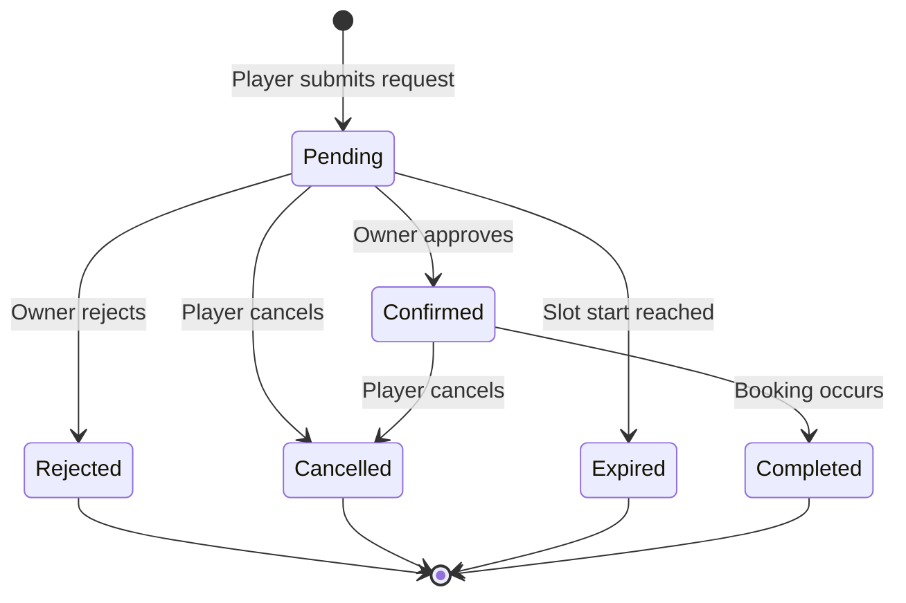
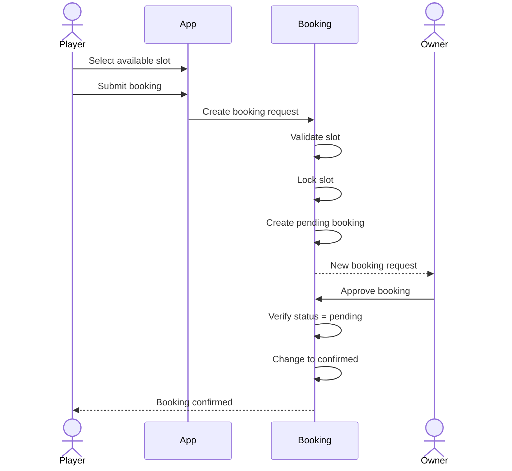
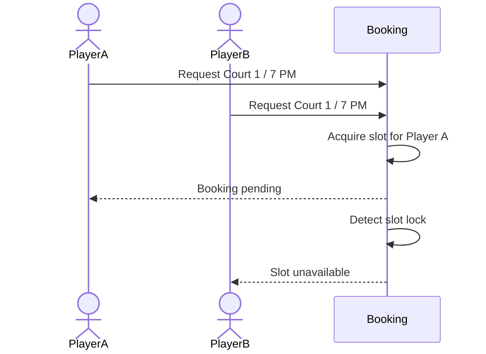
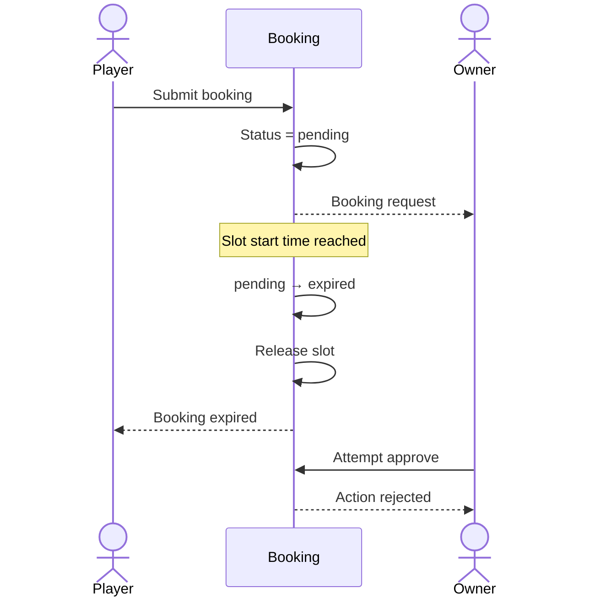
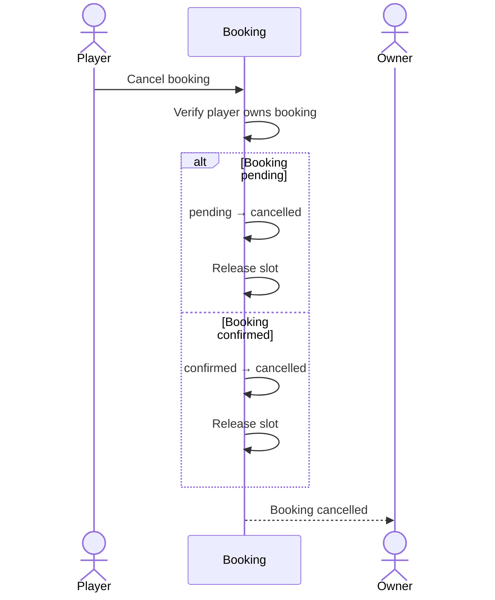

# Booking Feature Specification

## 1. Purpose

This document defines the functional behavior of the booking feature for the MVP.

It specifies:

- Booking eligibility
- Booking creation
- Slot locking
- Booking states
- State transitions
- Player permissions
- Gym-owner permissions
- Automatic expiry
- Booking completion
- Notifications
- Validation rules
- Error behavior
- Acceptance criteria

This document is implementation-agnostic.

Database schemas, transactions, API endpoints, background jobs, and infrastructure belong in architecture and API documentation.

---

# 2. Related Documents

This specification is derived from:

```text
docs/product/vision.md
docs/product/requirements.md
docs/product/mvp.md
docs/flows/booking.md
docs/flows/player-discovery.md
docs/flows/owner-booking-management.md
```

If this specification conflicts with an established product requirement, the product requirement must be reviewed before implementation.

---

# 3. Actors

## Player

A player can:

- View available slots.
- Submit a booking request.
- View their bookings.
- View booking status.
- Cancel pending bookings.
- Cancel confirmed bookings.

---

## Gym Owner

A gym owner can:

- View bookings associated with venues they manage.
- View pending booking requests.
- Approve pending bookings.
- Reject pending bookings.
- View confirmed bookings.
- View booking history.

A gym owner cannot cancel a confirmed booking.

---

## System

The system is responsible for:

- Validating booking eligibility.
- Preventing conflicting bookings.
- Locking slots.
- Managing booking state transitions.
- Automatically expiring pending bookings.
- Releasing slots when appropriate.
- Generating booking notifications.
- Completing confirmed bookings when applicable.

---

# 4. Domain Terminology

## Venue

A physical sports location managed by a gym owner.

A venue may contain multiple courts.

---

## Court

A rentable playing area belonging to a venue.

A court defines:

- Supported sport
- Price
- Operating schedule
- Slot duration

---

## Time Slot

A fixed period generated from the court's configured schedule and slot duration.

Example:

```text
Court operating hours:
08:00–12:00

Slot duration:
60 minutes

Generated slots:

08:00–09:00
09:00–10:00
10:00–11:00
11:00–12:00
```

---

## Booking

A player's request to reserve one court for one date and one fixed time slot.

---

# 5. Booking Identity

A booking must be associated with exactly:

- One player
- One venue
- One court
- One booking date
- One start time
- One end time
- One booking status

A booking should also preserve the price applicable when the booking request was created.

---

# 6. Booking States

The MVP supports:

```text
pending
confirmed
rejected
cancelled
expired
completed
```

---

# 7. Booking State Definitions

## Pending

The player has submitted a request and the gym owner has not yet responded.

While pending:

- The slot is locked.
- Other players cannot request the same slot.
- The owner may approve.
- The owner may reject.
- The player may cancel.

---

## Confirmed

The gym owner approved the request.

While confirmed:

- The slot remains unavailable.
- The player may cancel.
- The gym owner cannot cancel.
- The gym owner cannot reject.
- The gym owner cannot move it back to pending.

---

## Rejected

The gym owner rejected the request.

When rejected:

- The booking is final.
- The slot is released.
- The player cannot reactivate the booking.

---

## Cancelled

The player cancelled the booking.

When cancelled:

- The booking is final.
- The associated slot is released.

---

## Expired

The booking remained pending until its slot started.

When expired:

- The booking is final.
- The slot is released.
- The owner can no longer approve or reject the booking.

---

## Completed

The confirmed booking period has occurred.

Completed bookings are historical records.

---

# 8. State Transition Model



No transitions outside this state model are valid for the MVP.

---

# 9. Booking Eligibility

Before a booking can be created, all of the following must be true.

## BOOK-SPEC-001 — Authenticated Player

The requesting user must:

- Be authenticated.
- Have player booking privileges.

---

## BOOK-SPEC-002 — Valid Venue

The selected venue must:

- Exist.
- Be active.
- Be discoverable.
- Be available for booking.

---

## BOOK-SPEC-003 — Valid Court

The selected court must:

- Exist.
- Belong to the selected venue.
- Be available for booking.

---

## BOOK-SPEC-004 — Valid Date

The booking date must:

- Be today or later.
- Fall within the venue's configured booking advance window.

Example:

```text
Today:
August 27

Advance window:
14 days

Allowed booking dates:
August 27 → September 10
```

---

## BOOK-SPEC-005 — Valid Slot

The selected slot must:

- Belong to the selected court.
- Correspond to the court's schedule.
- Follow the court's configured slot duration.
- Not have already started.
- Be available for booking.

---

# 10. Same-Day Booking

Same-day bookings are allowed.

Example:

```text
Current time:
2:30 PM

Available:

3:00–4:00 PM
4:00–5:00 PM

Unavailable:

1:00–2:00 PM
2:00–3:00 PM
```

A slot whose start time is less than or equal to the current time cannot be requested.

---

# 11. Booking Creation

## BOOK-SPEC-006 — Create Booking

When the player submits a valid booking request:

1. The system validates the selected slot.
2. The system ensures the slot is not already locked.
3. A booking is created.
4. The booking status becomes `pending`.
5. The slot becomes locked.
6. The gym owner is notified.

Conceptually:

```text
available
   ↓
player submits
   ↓
validate
   ↓
create booking
   ↓
pending
   ↓
lock slot
```

---

# 12. Slot Locking

## BOOK-SPEC-007 — Exclusive Slot Lock

Only one active booking may hold a specific:

```text
court + booking date + time slot
```

A slot is considered unavailable while associated with:

```text
pending
confirmed
```

---

## Slot Availability by Booking State

| Booking Status |             Slot Available |
| -------------- | -------------------------: |
| `pending`      |                         No |
| `confirmed`    |                         No |
| `rejected`     |                        Yes |
| `cancelled`    |                        Yes |
| `expired`      |                        Yes |
| `completed`    | No for the historical slot |

A completed historical slot does not become bookable again because its date/time is already in the past.

---

# 13. Concurrent Booking Requests

Two players may view the same slot as available at approximately the same time.

Example:

```text
Player A → sees 7:00–8:00 PM available
Player B → sees 7:00–8:00 PM available

Player A → submits
Player B → submits
```

Only one request may successfully acquire the slot.

The other request must fail with a slot-unavailable result.

The user should then be allowed to select another available slot.

---

# 14. Pending Booking

After creation:

```text
status = pending
```

The booking waits for gym-owner action.

The player should be able to see that approval is still required.

Example display:

```text
Booking Request

Status:
Pending approval

Venue:
ABC Sports Center

Court:
Court 1

Date:
September 5

Time:
7:00 PM–8:00 PM

Payment:
Pay at venue
```

---

# 15. Owner Approval

## BOOK-SPEC-008 — Approve Pending Booking

A gym owner may approve a booking only when:

```text
status = pending
```

and the owner is authorized to manage the booking's venue.

The transition is:

```text
pending → confirmed
```

---

## Approval Effects

After approval:

- Booking becomes `confirmed`.
- Slot remains locked.
- Player is notified.
- Owner approval action becomes unavailable.
- Owner rejection action becomes unavailable.
- Owner cancellation remains unavailable.

---

# 16. Owner Rejection

## BOOK-SPEC-009 — Reject Pending Booking

A gym owner may reject a booking only while:

```text
status = pending
```

The transition is:

```text
pending → rejected
```

---

## Rejection Effects

After rejection:

- Booking becomes `rejected`.
- Slot lock is released.
- The slot may become available to other players.
- Player is notified.
- The booking cannot later be approved.

---

# 17. Player Cancellation

## BOOK-SPEC-010 — Cancel Pending Booking

A player may cancel their own pending booking.

Transition:

```text
pending → cancelled
```

Effects:

- Slot lock is released.
- Gym owner is notified.

---

## BOOK-SPEC-011 — Cancel Confirmed Booking

For the MVP, a player may cancel their own confirmed booking.

Transition:

```text
confirmed → cancelled
```

Effects:

- Slot is released if the booking time has not passed.
- Gym owner is notified.

This behavior is explicitly an MVP rule and may change later.

---

# 18. Player Cancellation Authorization

A player may only cancel a booking they own.

A player must not be able to cancel another player's booking.

---

# 19. Owner Cancellation Restriction

## BOOK-SPEC-012 — Confirmed Booking Cannot Be Cancelled by Owner

A gym owner cannot perform:

```text
confirmed → cancelled
```

The owner must make the decision while the booking is still pending.

Valid owner transitions are only:

```text
pending → confirmed
pending → rejected
```

---

# 20. Automatic Expiry

## BOOK-SPEC-013 — Expire Pending Booking

When a booking remains pending until the selected slot begins:

```text
pending → expired
```

This transition must happen automatically.

---

## Expiry Effects

After expiry:

- Booking becomes `expired`.
- Slot lock is released.
- Owner approval becomes invalid.
- Owner rejection becomes invalid.
- Player is notified.

---

## Expiry Example

```text
Booking:
September 5
7:00 PM–8:00 PM

Status at 6:59 PM:
pending

Status when booking start is reached:
expired
```

---

# 21. Expired Action Protection

If the gym owner has an expired booking open and attempts to approve it:

```text
Owner sees:
pending

Actual server state:
expired

Owner selects:
Approve
```

The approval must fail.

The application should refresh and display:

```text
expired
```

---

# 22. Booking Completion

## BOOK-SPEC-014 — Complete Confirmed Booking

A confirmed booking should become completed after its scheduled booking period has occurred.

Transition:

```text
confirmed → completed
```

The exact automatic processing mechanism is not specified here.

---

# 23. Completion Timing

For the MVP, completion should conceptually happen after:

```text
booking end time <= current time
```

provided the booking is still:

```text
confirmed
```

Example:

```text
Booking:
7:00 PM–8:00 PM

7:59 PM:
confirmed

After 8:00 PM:
completed
```

---

# 24. Booking Price

## BOOK-SPEC-015 — Booking Price Snapshot

The booking should preserve the price shown to the player at the time the request is created.

Example:

```text
Court price when booked:
₱500

Owner later changes court price:
₱600

Existing booking price:
₱500
```

The existing booking should not silently change.

This prevents historical bookings from changing when venue pricing changes.

---

# 25. Payment

Payment is not processed by the application.

A confirmed booking should communicate:

```text
Payment:
Pay at venue
```

The system does not track:

- Paid
- Unpaid
- Refund
- Deposit
- Payment method

for the MVP.

---

# 26. Player Booking List

A player should be able to view their bookings.

Bookings may be grouped conceptually as:

```text
Upcoming
├── Pending
└── Confirmed

History
├── Completed
├── Cancelled
├── Rejected
└── Expired
```

Exact UI organization is not required by this specification.

---

# 27. Gym Owner Booking List

A gym owner should be able to view bookings for venues they manage.

Suggested grouping:

```text
Action Required
└── Pending

Upcoming
└── Confirmed

History
├── Completed
├── Cancelled
├── Rejected
└── Expired
```

---

# 28. Owner Authorization

## BOOK-SPEC-016 — Venue Ownership Validation

A gym owner may only manage bookings associated with venues they are authorized to manage.

Example:

```text
Owner A
└── Venue A

Owner B
└── Venue B
```

Owner A must not approve or reject bookings for Venue B.

---

# 29. Booking Notifications

## BOOK-SPEC-017 — New Request Notification

When:

```text
booking created → pending
```

notify the gym owner.

---

## BOOK-SPEC-018 — Confirmation Notification

When:

```text
pending → confirmed
```

notify the player.

---

## BOOK-SPEC-019 — Rejection Notification

When:

```text
pending → rejected
```

notify the player.

---

## BOOK-SPEC-020 — Player Cancellation Notification

When:

```text
pending → cancelled
```

or:

```text
confirmed → cancelled
```

notify the gym owner.

---

## BOOK-SPEC-021 — Expiry Notification

When:

```text
pending → expired
```

notify the player.

---

# 30. Booking Reminder

A confirmed booking may generate a reminder before its scheduled start time.

The exact reminder timing is not established yet.

Example future rule:

```text
Notify player:
1 hour before booking
```

This timing must be defined separately before implementation.

---

# 31. Invalid State Transitions

The following transitions must not be permitted:

```text
confirmed → rejected
confirmed → pending
confirmed → expired

rejected → pending
rejected → confirmed

cancelled → pending
cancelled → confirmed

expired → pending
expired → confirmed

completed → pending
completed → confirmed
```

---

# 32. Booking Permission Matrix

| Action        | Pending | Confirmed | Rejected | Cancelled | Expired | Completed |
| ------------- | ------: | --------: | -------: | --------: | ------: | --------: |
| Player view   |     Yes |       Yes |      Yes |       Yes |     Yes |       Yes |
| Player cancel |     Yes |       Yes |       No |        No |      No |        No |
| Owner view    |     Yes |       Yes |      Yes |       Yes |     Yes |       Yes |
| Owner approve |     Yes |        No |       No |        No |      No |        No |
| Owner reject  |     Yes |        No |       No |        No |      No |        No |
| Owner cancel  |      No |        No |       No |        No |      No |        No |

---

# 33. Validation Errors

The booking feature should distinguish common validation failures.

Possible cases include:

```text
SLOT_UNAVAILABLE
SLOT_ALREADY_STARTED
DATE_OUTSIDE_BOOKING_WINDOW
COURT_UNAVAILABLE
VENUE_UNAVAILABLE
BOOKING_NOT_PENDING
BOOKING_ALREADY_CANCELLED
BOOKING_EXPIRED
UNAUTHORIZED_BOOKING_ACCESS
```

These names are conceptual and do not define API error codes yet.

---

# 34. Slot Unavailable Behavior

If the player submits a request and the slot is no longer available:

The system must:

1. Reject the booking attempt.
2. Not create an active booking.
3. Inform the player.
4. Allow the player to refresh/select another slot.

Example message:

```text
This time slot is no longer available.

Please choose another time.
```

---

# 35. Booking State Changed During Owner Action

If an owner attempts an action against stale state:

Example:

```text
Owner opens pending booking.

Player cancels.

Owner presses Approve.
```

The system must:

- Reject the approval.
- Preserve `cancelled`.
- Return the current booking state.

---

# 36. Booking Data Snapshot

The booking should preserve important booking-time information so later venue changes do not make the historical record misleading.

At minimum, consider preserving:

- Court identifier
- Venue identifier
- Booking date
- Start time
- End time
- Price

The exact database strategy will be defined later.

---

# 37. Booking Business Invariants

The following must always remain true.

## INV-001

A booking belongs to exactly one player.

## INV-002

A booking belongs to exactly one court.

## INV-003

A court belongs to exactly one venue.

## INV-004

Only one active booking may lock a court/date/time slot.

## INV-005

Only pending bookings may be approved.

## INV-006

Only pending bookings may be rejected.

## INV-007

Owners cannot cancel confirmed bookings.

## INV-008

Players may currently cancel pending and confirmed bookings.

## INV-009

Expired bookings cannot be approved.

## INV-010

Rejected bookings cannot be approved later.

## INV-011

Cancelled bookings cannot be restored.

## INV-012

Past slots cannot receive new booking requests.

## INV-013

Confirmed bookings keep their slots unavailable.

## INV-014

Rejected, cancelled, and expired bookings release their slot.

---

# 38. Main Booking Scenario



---

# 39. Slot Conflict Scenario



The exact locking mechanism belongs in architecture documentation.

---

# 40. Expiry Scenario



---

# 41. Player Cancellation Scenario



---

# 42. Acceptance Criteria — Booking Creation

A booking request is considered correctly implemented when:

- [ ] Player must be authenticated.
- [ ] Venue must be valid.
- [ ] Court must belong to the venue.
- [ ] Booking date must be valid.
- [ ] Date must be within the venue booking window.
- [ ] Slot must not have started.
- [ ] Slot must be available.
- [ ] Only one player can acquire the slot.
- [ ] Booking starts as `pending`.
- [ ] Pending booking locks the slot.
- [ ] Gym owner receives notification.

---

# 43. Acceptance Criteria — Owner Approval

- [ ] Owner must be authorized for the venue.
- [ ] Booking must currently be `pending`.
- [ ] Approval changes status to `confirmed`.
- [ ] Slot remains unavailable.
- [ ] Player receives confirmation.
- [ ] Owner cannot approve the same booking again.
- [ ] Owner cannot reject after confirmation.
- [ ] Owner cannot cancel after confirmation.

---

# 44. Acceptance Criteria — Owner Rejection

- [ ] Owner must be authorized for the venue.
- [ ] Booking must currently be `pending`.
- [ ] Rejection changes status to `rejected`.
- [ ] Slot is released.
- [ ] Player receives notification.
- [ ] Booking cannot later be approved.

---

# 45. Acceptance Criteria — Player Cancellation

- [ ] Player may cancel their own pending booking.
- [ ] Player may cancel their own confirmed booking.
- [ ] Player cannot cancel another player's booking.
- [ ] Cancellation changes status to `cancelled`.
- [ ] Slot is released.
- [ ] Owner receives notification.
- [ ] Cancelled booking cannot be restored.

---

# 46. Acceptance Criteria — Expiry

- [ ] Pending booking expires when its slot starts.
- [ ] Status becomes `expired`.
- [ ] Slot is released.
- [ ] Owner can no longer approve.
- [ ] Owner can no longer reject.
- [ ] Player receives an expiry notification.

---

# 47. Acceptance Criteria — Completion

- [ ] Only confirmed bookings may complete.
- [ ] Completion occurs after the booking period.
- [ ] Status changes to `completed`.
- [ ] Completed booking remains available in booking history.

---

# 48. Out of Scope

The booking feature does not currently include:

- Online payment
- Deposits
- Refunds
- Cancellation fees
- Owner cancellation of confirmed bookings
- Rescheduling
- Recurring booking
- Multi-slot booking
- Booking multiple courts in one request
- Waiting lists
- Chat
- Promo codes
- Dynamic pricing
- Player ratings
- Owner ratings
- No-show handling
- Dispute management

These features require explicit future product requirements before implementation.

---

# 49. Open Specification Items

The following details remain intentionally unresolved.

## OPEN-BOOK-001 — Booking Reminder Timing

Determine when booking reminders should be sent.

---

## OPEN-BOOK-002 — Completion Processing

Determine the technical mechanism used to automatically complete confirmed bookings.

---

# 50. Specification Status

**Status:** Draft

The booking feature behavior is sufficiently defined to support:

- Venue/court specification
- Booking architecture
- API contract design
- Database modeling

Date-specific schedule exceptions and their slot-generation behavior are defined by the [Availability Feature Specification](availability.md). Booking eligibility must use the resolved availability for the requested court and date.

Technical implementation must preserve the business rules and state invariants defined in this document.
