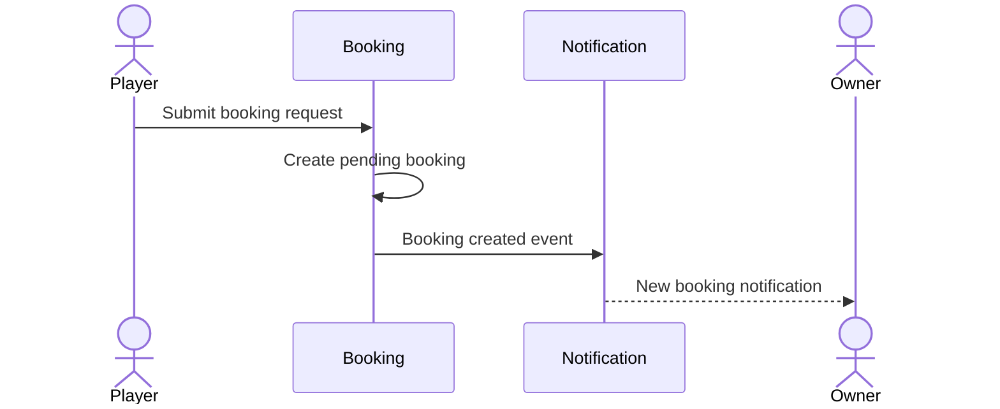
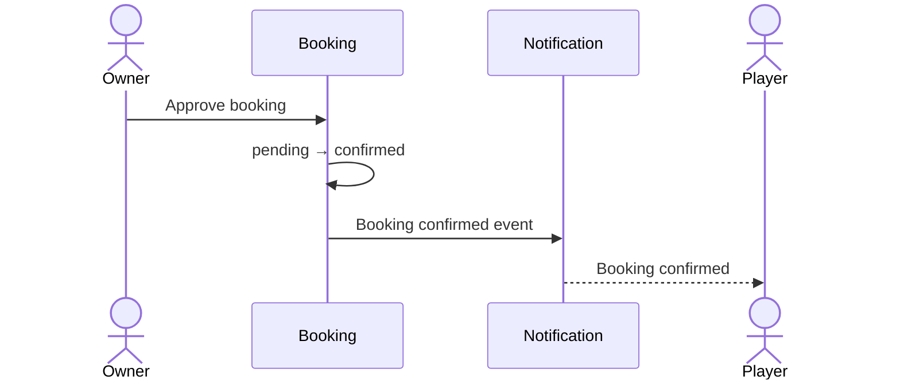
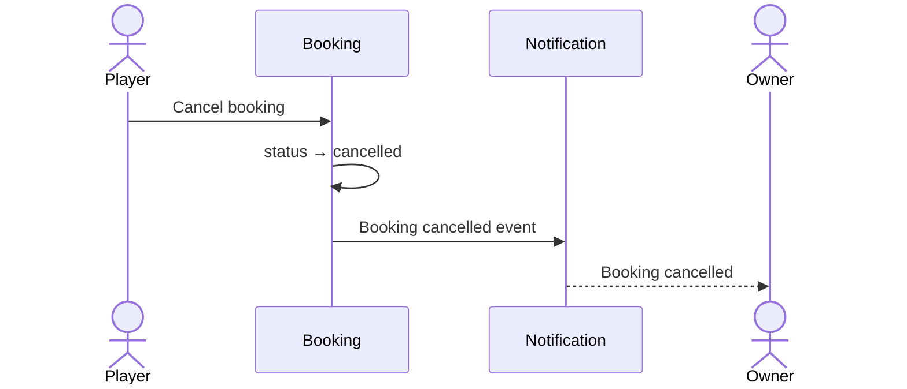

# Notifications Specification

## 1. Purpose

This document defines notification behavior for the MVP.

It specifies:

- Booking-related notification events
- Notification recipients
- Notification content expectations
- Read/unread behavior
- Delivery behavior
- Notification history
- Error handling
- Acceptance criteria

This document describes product behavior only.

Push notification providers, device-token storage, delivery retries, background processing, and notification APIs belong in architecture and API documentation.

---

# 2. Related Documents

This specification is derived from:

```text
docs/product/requirements.md
docs/product/mvp.md

docs/flows/booking.md
docs/flows/owner-booking-management.md

docs/specs/booking.md
docs/specs/authentication.md
```

---

# 3. Notification Goals

Notifications should help users understand important booking changes without requiring them to manually refresh the application.

For MVP, notifications should focus on events that require attention or communicate meaningful booking state changes.

---

# 4. Notification Recipients

The MVP supports notifications for:

```text
player
gym_owner
```

The recipient depends on the booking event.

---

# 5. Notification Channels

The MVP should support:

- In-app notification history
- Push notifications where device notification permission is available

Push notifications should enhance the application but should not be required for the booking system to function correctly.

---

# 6. Notification Independence

A booking state transition must not depend on successful notification delivery.

For example:

```text
Owner approves booking
        ↓
Booking becomes confirmed
        ↓
Notification delivery attempted
```

If notification delivery fails:

```text
Booking remains confirmed
```

The system must not roll back a valid booking action because a push notification failed.

---

# 7. Notification Events

The MVP requires notifications for the following events:

```text
1. New booking request
2. Booking confirmed
3. Booking rejected
4. Player cancellation
5. Booking expired
6. Booking reminder
```

---

# 8. New Booking Request

## NOTIF-SPEC-001 — Notify Gym Owner

When a player successfully creates a booking request:

```text
booking created
      ↓
status = pending
```

the responsible gym owner should receive a notification.

---

## Recipient

```text
gym_owner
```

---

## Example Content

```text
New booking request

Juan requested Court 1 at ABC Sports Center
for September 5, 7:00 PM–8:00 PM.
```

The exact wording may vary.

---

## Notification Action

Selecting the notification should open the relevant booking details where supported.

Conceptually:

```text
Notification
     ↓
Booking Detail
```

---

# 9. Booking Confirmation

## NOTIF-SPEC-002 — Notify Player on Approval

When:

```text
pending → confirmed
```

the player should receive a notification.

---

## Recipient

```text
player
```

---

## Example Content

```text
Booking confirmed

Your booking at ABC Sports Center has been approved.

September 5
7:00 PM–8:00 PM

Payment: Pay at venue
```

---

# 10. Booking Rejection

## NOTIF-SPEC-003 — Notify Player on Rejection

When:

```text
pending → rejected
```

the player should receive a notification.

---

## Recipient

```text
player
```

---

## Example Content

```text
Booking request declined

Your booking request for Court 1 at
ABC Sports Center was not approved.
```

---

# 11. Player Cancellation

## NOTIF-SPEC-004 — Notify Gym Owner on Cancellation

When a player cancels:

```text
pending → cancelled
```

or:

```text
confirmed → cancelled
```

the responsible gym owner should receive a notification.

---

## Recipient

```text
gym_owner
```

---

## Example Content

```text
Booking cancelled

Juan cancelled the booking for Court 1
on September 5, 7:00 PM–8:00 PM.
```

---

# 12. Booking Expiry

## NOTIF-SPEC-005 — Notify Player on Expiry

When:

```text
pending → expired
```

the player should receive a notification.

---

## Recipient

```text
player
```

---

## Example Content

```text
Booking request expired

Your booking request was not approved
before the scheduled time.
```

---

# 13. Booking Reminder

## NOTIF-SPEC-006 — Confirmed Booking Reminder

The system should support reminding the player before an upcoming confirmed booking.

Only:

```text
confirmed
```

bookings are eligible for reminders.

---

## Recipient

```text
player
```

---

## Example Content

```text
Upcoming booking

You have a booking at ABC Sports Center today
at 7:00 PM.

Payment: Pay at venue
```

---

# 14. Reminder Timing

The exact reminder timing is not yet established.

Possible future rule:

```text
1 hour before booking
```

The implementation must not assume a timing rule until it is explicitly defined.

---

# 15. Cancelled Booking Reminder Prevention

If a booking becomes cancelled before its reminder is sent:

```text
confirmed
   ↓
cancelled
```

the reminder must not be sent.

---

# 16. Non-Confirmed Reminder Prevention

The system must not send booking reminders for:

```text
pending
rejected
cancelled
expired
completed
```

---

# 17. In-App Notification History

## NOTIF-SPEC-007 — Notification List

Authenticated users should have access to their notification history.

Possible display:

```text
Notifications

Booking confirmed
ABC Sports Center
5 minutes ago

Booking request expired
Downtown Courts
Yesterday
```

---

# 18. Notification Ownership

Users must only see notifications addressed to their own account.

Player A must not see notifications belonging to Player B.

Gym Owner A must not see notifications belonging to Gym Owner B.

---

# 19. Read State

## NOTIF-SPEC-008 — Read and Unread Notifications

Notifications should support:

```text
unread
read
```

A newly created notification starts as unread.

---

# 20. Mark Notification Read

When a user opens or explicitly marks a notification:

```text
unread → read
```

The exact UI behavior may vary.

---

# 21. Unread Count

The application may show the number of unread notifications.

Example:

```text
Notifications (3)
```

The unread count must represent notifications belonging to the authenticated user.

---

# 22. Mark All as Read

The MVP may support marking all of the user's notifications as read.

This should only affect notifications belonging to the current account.

---

# 23. Notification Navigation

Where applicable, notification actions should lead users to relevant application content.

Examples:

```text
New booking request
      ↓
Owner booking detail
```

```text
Booking confirmed
      ↓
Player booking detail
```

```text
Booking cancelled
      ↓
Owner booking detail
```

The application must still validate authorization after navigation.

---

# 24. Push Notification Permission

Device push-notification permission is optional.

If permission is granted:

```text
System may deliver push notification
```

If permission is denied:

```text
Booking feature continues to work
```

The user can still access in-app notifications.

---

# 25. Push Notification Failure

Push delivery can fail for reasons such as:

- Invalid device token
- Device offline
- Provider failure
- Notification permission disabled

These failures must not change booking state.

---

# 26. Multiple Devices

A user may eventually authenticate on more than one device.

The notification architecture may deliver push notifications to multiple valid devices associated with the same account.

The exact device-token strategy is an implementation decision.

---

# 27. Duplicate Notification Prevention

The system should avoid intentionally creating duplicate notifications for the same event.

Example:

```text
pending → confirmed
```

should normally create one logical confirmation notification for the player.

Retries in infrastructure should not create multiple logical notification records.

---

# 28. Notification Event Source

Notifications should be generated from successful domain events.

Example:

```text
Owner requests approval
       ↓
Booking successfully changes
pending → confirmed
       ↓
Create confirmation notification
```

Not:

```text
Owner taps approve
       ↓
Immediately notify player
       ↓
Booking update later fails
```

The notification must correspond to a successfully completed booking state change.

---

# 29. New Booking Sequence



---

# 30. Approval Notification Sequence



---

# 31. Cancellation Notification Sequence



---

# 32. Notification Data

A notification should contain enough information to:

- Identify the recipient
- Identify notification type
- Display useful text
- Link to the relevant resource where applicable
- Determine read state
- Determine creation time

Conceptually:

```text
recipient
type
title
body
related resource
read state
created time
```

The exact database structure belongs in architecture.

---

# 33. Notification Types

Conceptual notification types may include:

```text
booking_request_created
booking_confirmed
booking_rejected
booking_cancelled
booking_expired
booking_reminder
```

These names may later be used as domain or API constants.

---

# 34. Notification Priority

For MVP, all booking state-change notifications are important.

The system does not need complex priority levels such as:

```text
low
medium
high
critical
```

unless required by the notification provider.

---

# 35. Notification Content Rules

Notification content should be:

- Short
- Clear
- Action-oriented when necessary
- Explicit about important booking status

Where relevant, it may include:

- Venue
- Court
- Date
- Time

Sensitive/private information should not be unnecessarily exposed in push notification text.

---

# 36. Notification Time Display

In-app notification history should display when the notification occurred.

Examples:

```text
5 minutes ago
2 hours ago
Yesterday
```

or an equivalent localized representation.

The exact formatting belongs in client implementation.

---

# 37. Notification Error Cases

Conceptual cases include:

```text
NOTIFICATION_NOT_FOUND
UNAUTHORIZED_NOTIFICATION_ACCESS
NOTIFICATION_DELIVERY_FAILED
INVALID_NOTIFICATION_TARGET
```

Push delivery failures should normally be handled internally rather than presented as booking errors.

---

# 38. Notification Invariants

## INV-NOTIF-001

A notification belongs to exactly one recipient account.

## INV-NOTIF-002

Users cannot read another user's private notification history.

## INV-NOTIF-003

Booking state changes do not depend on successful push delivery.

## INV-NOTIF-004

Notifications are created only after the corresponding domain event succeeds.

## INV-NOTIF-005

Cancelled bookings do not receive upcoming booking reminders.

## INV-NOTIF-006

Only confirmed bookings receive booking reminders.

## INV-NOTIF-007

New notifications begin unread.

## INV-NOTIF-008

Reading a notification does not affect its related booking state.

---

# 39. Acceptance Criteria — New Booking Request

- [ ] Successful booking creation produces owner notification.
- [ ] Notification goes to the owner responsible for the venue.
- [ ] Notification references the relevant booking.
- [ ] Booking remains valid if push delivery fails.
- [ ] Notification appears in owner's in-app history.

---

# 40. Acceptance Criteria — Confirmation

- [ ] Successful owner approval produces player notification.
- [ ] Notification is created only after booking becomes confirmed.
- [ ] Notification identifies the relevant booking.
- [ ] Player can open relevant booking details where supported.

---

# 41. Acceptance Criteria — Rejection

- [ ] Successful rejection produces player notification.
- [ ] Notification is created after status becomes rejected.
- [ ] Player can identify which booking was rejected.

---

# 42. Acceptance Criteria — Cancellation

- [ ] Player cancellation produces owner notification.
- [ ] Both pending and confirmed cancellations are supported.
- [ ] Notification references the cancelled booking.
- [ ] Failed push delivery does not undo cancellation.

---

# 43. Acceptance Criteria — Expiry

- [ ] Automatic booking expiry produces player notification.
- [ ] Notification is created after status becomes expired.
- [ ] Expired booking cannot later be approved.

---

# 44. Acceptance Criteria — Read State

- [ ] New notification starts unread.
- [ ] User can mark notification as read.
- [ ] User can see unread status.
- [ ] Read changes affect only the authenticated user's notifications.
- [ ] Notification read state does not modify booking state.

---

# 45. Acceptance Criteria — Push Permission

- [ ] Push permission denial does not block application usage.
- [ ] In-app notification history remains available.
- [ ] Push-enabled devices may receive booking notifications.
- [ ] Disabled push notifications do not cause booking actions to fail.

---

# 46. Out of Scope

The MVP notification system does not currently include:

- Player-to-player notifications
- Chat notifications
- Marketing notifications
- Promotional campaigns
- Venue advertisements
- Social activity notifications
- Friend/follower notifications
- Tournament notifications
- Advanced notification preferences
- Notification categories configurable by users
- SMS notifications
- Email booking notifications
- AI-generated notification content

These require explicit future requirements.

---

# 47. Open Specification Items

## OPEN-NOTIF-001 — Reminder Timing

Determine exactly when confirmed booking reminders are sent.

Recommended starting point:

```text
1 hour before booking
```

but this is not established yet.

---

## OPEN-NOTIF-002 — Reminder Count

Determine whether the MVP sends:

```text
one reminder
```

or multiple reminders.

The simpler MVP approach is one reminder.

---

## OPEN-NOTIF-003 — Notification Retention

Determine how long in-app notifications remain stored.

---

## OPEN-NOTIF-004 — Owner Expiry Notification

Currently the player is notified when a pending booking expires.

Determine whether the owner also needs an expiry notification.

This may not be necessary because the request simply disappears from the action-required state.

---

# 48. Specification Status

**Status:** Draft

The notification behavior is sufficiently defined to support the booking MVP.

Implementation must preserve the key rule that notifications are a consequence of successful booking events and must never control whether those booking events succeed.
