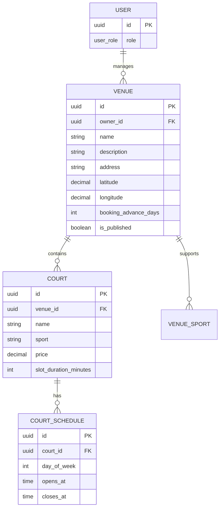
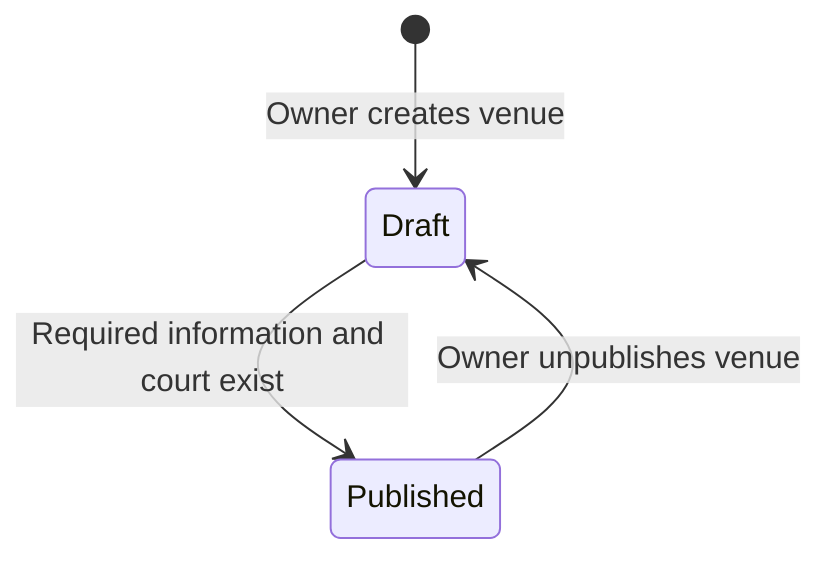

# Venue and Court Specification

## Purpose

Define the MVP domain model and behavior for gym-owner-managed venues and courts. This specification is the product source of truth for future database, API, and client work.

## Domain model



`VENUE_SPORT` is optional in the eventual physical schema if supported sports can be derived from courts. It remains part of this conceptual model because venues must be searchable by sport.

## Venue

A venue is the physical sports location listed by a gym owner. A gym owner may manage many venues; a venue belongs to exactly one gym owner.

### Required fields to publish

| Field | Rules |
|---|---|
| `name` | Required; player-visible venue name. |
| `address` | Required; player-visible address. |
| `latitude`, `longitude` | Required; used for nearby discovery and map display. |
| `description` | Required for the MVP; short player-visible summary. |
| `bookingAdvanceDays` | Required positive whole number; maximum number of calendar days ahead a player may request a slot. |
| At least one court | Required before publication. |

### Optional fields

- Photos.
- Contact information.
- Facility information or amenities.

These may be displayed to players when present, but should not block initial venue publication unless the product requirements change.

### Venue lifecycle



- Only `published` venues are returned in player discovery.
- Owners can view and edit both draft and published venues they manage.
- Unpublishing prevents new discovery and booking requests. It must not alter existing bookings.

## Court

A court is a bookable area within exactly one venue. A venue contains one or more courts.

### Required fields

| Field | Rules |
|---|---|
| `venueId` | Required; immutable relationship to the owning venue. |
| `name` | Required; unique within its venue. |
| `sport` | Required; one supported sport for this court. |
| `price` | Required non-negative monetary amount, shown before booking. |
| `slotDurationMinutes` | Required positive whole number; determines generated fixed slots. |
| Operating schedule | Required before the court has bookable availability. |

### Court behavior

- Different courts at the same venue may have different sports, prices, schedules, and slot durations.
- Players do not enter arbitrary start and end times.
- Fixed slots are generated from the court's schedule and slot duration for the selected date.
- Court availability additionally accounts for active bookings as specified in [the booking flow](../flows/booking.md).
- A court may be unavailable for booking when it has no schedule or its venue is not published.

## Operating schedule and generated slots

A court's operating schedule describes the recurring weekly windows in which it can accept bookings.

```text
Court schedule: Monday, 08:00–12:00
Slot duration: 60 minutes

Generated slots: 08:00–09:00, 09:00–10:00, 10:00–11:00, 11:00–12:00
```

Rules:

- A generated slot must fit completely inside the operating window.
- A partial remainder is not bookable. For example, an 08:00–09:30 window with a 60-minute duration generates only 08:00–09:00.
- A date-specific closure or special schedule is not part of the first schema iteration; it must be added explicitly before being treated as supported behavior.
- Changing a court's future schedule or slot duration updates future generated availability only. Existing confirmed bookings remain valid.

## Authorization

| Action | Player | Managing gym owner | Other gym owner |
|---|---:|---:|---:|
| View published venue | Yes | Yes | Yes |
| View own draft venue | No | Yes | No |
| Create venue or court | No | Yes | No |
| Edit venue or court | No | Yes | No |
| Publish or unpublish venue | No | Yes | No |
| View available slots | Yes | Yes | Yes, for published venues |

Role checks are coarse access control. Ownership checks are required wherever venue and court changes are handled.

## Invariants

1. A venue belongs to exactly one gym owner.
2. A court belongs to exactly one venue.
3. Court names are unique within a venue.
4. `slotDurationMinutes` and `bookingAdvanceDays` are positive whole numbers.
5. A published venue has all publication-required fields and at least one court.
6. Only published venues appear in player discovery.
7. A generated slot is never outside its court's operating schedule.
8. Existing confirmed bookings are not invalidated by editing future court availability.

## Deliberately unresolved details

These need a product decision before the implementation contract is finalized:

- Currency and whether a price is per slot, per hour, or both. The MVP currently treats price as the amount shown for a bookable slot.
- Maximum and minimum slot duration and booking-advance values.
- Photo storage provider and file limits.
- Date-specific closures, holidays, maintenance blocks, and special schedules.
- Whether an owner can delete a venue or court that has booking history; the safe initial behavior is soft deletion or unpublishing.
