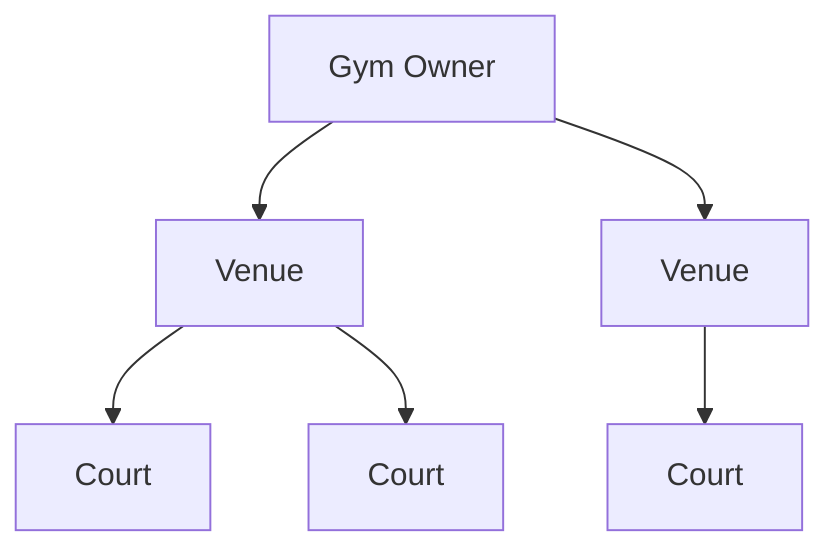
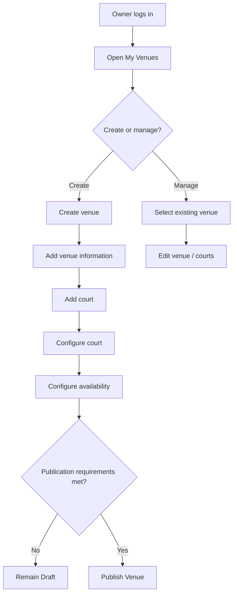
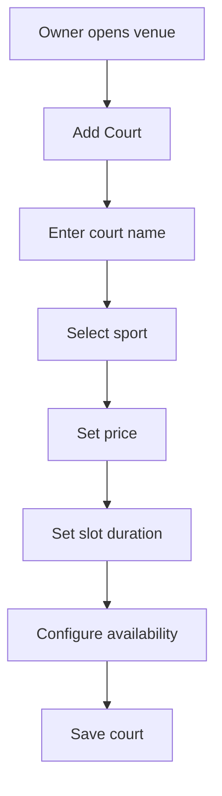
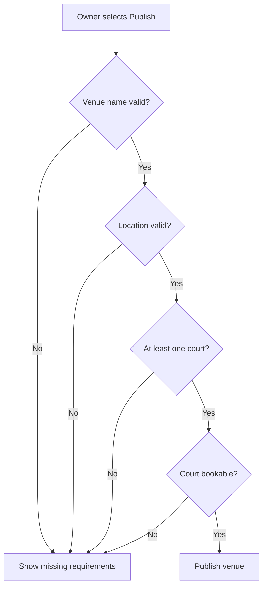

# Venue and Court Management Specification

## 1. Purpose

This document defines how gym owners create, manage, and publish venues and courts for the MVP.

It specifies:

- Venue ownership
- Multiple venues per owner
- Multiple courts per venue
- Venue information
- Court information
- Supported sports
- Pricing
- Operating configuration
- Publication rules
- Discoverability
- Editing behavior
- Authorization
- Acceptance criteria

This document describes product behavior only.

Database schema, file storage, geocoding, map providers, APIs, and media infrastructure belong in architecture and API documentation.

---

# 2. Related Documents

This specification is derived from:

```text
docs/product/requirements.md
docs/product/mvp.md

docs/flows/player-discovery.md
docs/flows/booking.md

docs/specs/booking.md
docs/specs/availability.md
```

---

# 3. Domain Hierarchy

The core ownership model is:



Conceptually:

```text
Gym Owner
├── Venue A
│   ├── Court 1
│   └── Court 2
│
└── Venue B
    ├── Court 1
    ├── Court 2
    └── Court 3
```

---

# 4. Gym Owner

## VENUE-SPEC-001 — Owner Authorization

Only an authenticated gym owner may create or manage venues.

A player account must not be able to perform venue-management actions.

---

## VENUE-SPEC-002 — Multiple Venues

A gym owner may manage multiple venues.

Each venue must be independently configurable.

Changing Venue A must not change Venue B.

---

# 5. Venue Definition

A venue represents a physical sports location that players can discover.

Examples:

```text
ABC Sports Center
Downtown Basketball Gym
Northside Badminton Center
```

A venue may contain one or more courts.

---

# 6. Required Venue Information

## VENUE-SPEC-003 — Venue Name

Every venue must have a name.

The name should be visible to players during discovery.

---

## VENUE-SPEC-004 — Venue Description

A venue should support a description.

The description may contain information such as:

- General venue information
- Facility details
- Rules
- Important player instructions

---

## VENUE-SPEC-005 — Venue Address

A venue must have a usable physical location.

The venue should store or represent:

- Address
- Geographic position

The exact geocoding strategy is not defined here.

---

## VENUE-SPEC-006 — Geographic Location

A venue must have valid geographic coordinates or equivalent location data before it can be discoverable through nearby search.

This location is used for:

- Nearby discovery
- Map display
- Distance calculations where applicable

---

# 7. Venue Photos

## VENUE-SPEC-007 — Venue Images

A gym owner should be able to add photos to a venue.

Photos may include:

- Venue exterior
- Court areas
- Facilities
- Amenities

The MVP should support at least one venue image.

The exact maximum number and storage strategy may be defined later.

---

# 8. Venue Contact Information

A venue may contain basic contact information.

Possible fields include:

- Phone number
- Email address

Because chat is outside the MVP, contact information may be useful operationally.

The exact required fields should remain minimal.

---

# 9. Venue Booking Advance Window

## VENUE-SPEC-008 — Booking Advance Configuration

Each venue must have a configurable booking advance window.

Example:

```text
Venue A:
7 days

Venue B:
30 days
```

All courts under the venue inherit this booking window.

---

# 10. Venue Status

A venue should have a lifecycle state that controls whether players can discover it.

At minimum:

```text
draft
published
```

---

## Draft

A draft venue:

- May be incomplete.
- Can be edited by the owner.
- Must not appear in player discovery.

---

## Published

A published venue:

- Is eligible for discovery.
- Has satisfied required publication information.
- May expose its courts and availability to players.

---

# 11. Venue Publication

## VENUE-SPEC-009 — Publish Venue

A gym owner must explicitly publish a venue before players can discover it.

Conceptually:

```text
Create venue
    ↓
Configure venue
    ↓
Add courts
    ↓
Configure availability
    ↓
Publish
    ↓
Discoverable
```

---

# 12. Publication Requirements

Before a venue can be published, it should have at least:

- Venue name
- Valid location
- At least one court
- At least one supported bookable court configuration
- Booking advance window

A court considered bookable should have enough configuration to generate availability.

---

# 13. Discoverability

## VENUE-SPEC-010 — Discoverable Venue

A venue may appear in player discovery only when:

- It is published.
- It belongs to an authorized active owner.
- It has a valid location.
- It contains at least one usable court.

---

# 14. Unpublish Venue

A gym owner should be able to make a venue unavailable to new player discovery.

Conceptually:

```text
published → draft/unpublished
```

The exact status name may be finalized during architecture.

Unpublishing a venue must not silently delete existing bookings.

---

# 15. Existing Bookings When Unpublished

If a venue is unpublished while bookings already exist:

- Existing pending bookings remain valid.
- Existing confirmed bookings remain valid.
- Historical bookings remain accessible.
- New booking requests should no longer be created through discovery.

The owner must continue managing existing bookings.

---

# 16. Court Definition

A court represents a specific rentable playing area inside a venue.

Examples:

```text
Court 1
Court A
Main Basketball Court
Badminton Court 3
```

---

# 17. Multiple Courts

## COURT-SPEC-001 — Multiple Courts Per Venue

A venue may contain multiple courts.

Each court is independently configurable.

---

# 18. Court Required Information

A court should contain at least:

- Name or identifier
- Supported sport
- Price
- Slot duration
- Availability configuration

---

# 19. Court Name

## COURT-SPEC-002 — Court Identifier

Each court must have a human-readable name or identifier.

Examples:

```text
Court 1
Court 2
Main Court
Court A
```

Court names only need to be unique within their venue if uniqueness is required by the implementation.

---

# 20. Court Sport

## COURT-SPEC-003 — Supported Sport

Each court must specify the sport it supports.

Examples:

```text
Basketball
Badminton
Volleyball
Tennis
Futsal
```

For MVP simplicity, each court should represent one primary sport configuration.

If a physical court supports multiple sports, the product may later define how that should be represented.

---

# 21. Venue Supported Sports

A venue's supported sports should be derived from its courts.

Example:

```text
Venue

Court 1 → Basketball
Court 2 → Basketball
Court 3 → Badminton
```

Venue supported sports:

```text
Basketball
Badminton
```

This avoids maintaining two conflicting sport lists.

---

# 22. Sport Filtering

Player discovery may use the court sport to determine venue inclusion.

Example:

```text
Player filter:
Badminton
```

A venue should appear when it has at least one discoverable/bookable badminton court.

---

# 23. Court Price

## COURT-SPEC-004 — Court Price

Each court must have a booking price.

Example:

```text
Court 1:
₱500 per slot
```

Price represents the amount expected to be paid at the venue for one generated booking slot.

---

# 24. Price and Slot Duration

Because courts may have different slot durations, price applies to one slot for that court.

Example:

```text
Court A
60-minute slot
₱500

Court B
90-minute slot
₱700
```

The MVP does not require calculating an hourly normalized rate.

---

# 25. Price Changes

Gym owners may update the current court price.

New bookings use the new price.

Existing bookings retain the price captured when the request was created.

---

# 26. Court Slot Duration

## COURT-SPEC-005 — Slot Duration

Each court must have its own configured slot duration.

Examples:

```text
60 minutes
90 minutes
120 minutes
```

Slot generation behavior is defined in:

```text
docs/specs/availability.md
```

---

# 27. Court Availability

## COURT-SPEC-006 — Availability Configuration

Each court must have its own availability configuration.

This includes:

- Weekly schedule
- Closed days
- Operating periods
- Date-specific exceptions

---

# 28. Court Status

A court should support an availability/lifecycle state.

At minimum, the MVP needs a way for owners to prevent new bookings for a court.

Conceptually:

```text
active
inactive
```

---

## Active Court

An active court may generate bookable slots.

---

## Inactive Court

An inactive court:

- Must not expose new bookable slots.
- Should remain visible to the owner.
- Must preserve historical bookings.
- Must not delete existing booking records.

---

# 29. Court Deactivation and Existing Bookings

Deactivating a court must not automatically cancel:

- Pending bookings
- Confirmed bookings

Existing bookings remain governed by their booking state rules.

The owner must still manage pending requests.

---

# 30. Court Editing

## COURT-SPEC-007 — Edit Court

An owner may update:

- Court name
- Sport
- Price
- Slot duration
- Availability
- Active status

Changes affect future discovery and booking behavior.

---

# 31. Existing Booking Snapshot Protection

Court changes must not silently modify existing bookings.

Example:

```text
Existing booking:

Court:
Court 1

Sport:
Basketball

Time:
08:00–09:00

Price:
₱500
```

Owner later changes:

```text
Price:
₱600
```

Existing booking remains:

```text
₱500
```

---

# 32. Changing Court Sport

Changing the sport of a court affects future discovery and booking.

Existing bookings must remain understandable historically.

This may require preserving relevant booking-time information.

The exact snapshot strategy belongs in architecture.

---

# 33. Venue Editing

## VENUE-SPEC-011 — Edit Venue

An owner may update venue information such as:

- Name
- Description
- Address
- Location
- Photos
- Contact information
- Booking advance window

Changes should affect future discovery.

---

# 34. Venue Location Changes

Changing venue location must update where the venue appears in discovery and maps.

Existing bookings remain associated with the same venue.

A significant venue relocation while active bookings exist may eventually require additional business rules, but that is outside the MVP.

---

# 35. Venue Deletion

Hard-deleting a venue that has booking history is risky and should not be part of the normal MVP flow.

Prefer:

```text
unpublish / deactivate
```

rather than deleting the venue and its historical relationships.

Deletion behavior should be defined later if required.

---

# 36. Court Deletion

Similarly, courts with booking history should not normally be hard-deleted.

Prefer:

```text
inactive
```

This preserves:

- Booking history
- Reporting integrity
- Historical references

---

# 37. Owner Venue List

A gym owner should be able to view the venues they manage.

Example:

```text
My Venues

ABC Sports Center
Published

Downtown Courts
Draft

Northside Gym
Published
```

---

# 38. Venue Management Flow



---

# 39. Court Creation Flow



---

# 40. Publication Validation Flow



---

# 41. Authorization

## VENUE-SPEC-012 — Owner Resource Access

An owner must only modify venues they are authorized to manage.

Likewise, they may only modify courts belonging to those venues.

Example:

```text
Owner A
└── Venue A

Owner B
└── Venue B
```

Owner A cannot modify Venue B or its courts.

---

# 42. Player Permissions

Players may:

- View published venues.
- View discoverable courts.
- View current pricing.
- View current availability.

Players may not:

- Create venues.
- Modify venues.
- Create courts.
- Change pricing.
- Change availability.
- Publish/unpublish venues.

---

# 43. Validation Errors

Possible conceptual validation cases include:

```text
VENUE_NAME_REQUIRED
VENUE_LOCATION_REQUIRED
VENUE_NOT_PUBLISHABLE
VENUE_NOT_FOUND
COURT_NOT_FOUND
COURT_SPORT_REQUIRED
COURT_PRICE_INVALID
COURT_SLOT_DURATION_INVALID
COURT_AVAILABILITY_REQUIRED
UNAUTHORIZED_VENUE_ACCESS
UNAUTHORIZED_COURT_ACCESS
```

These are conceptual names and do not define API response codes yet.

---

# 44. Venue Invariants

## INV-VENUE-001

Every venue belongs to an authorized gym owner.

## INV-VENUE-002

An owner may manage multiple venues.

## INV-VENUE-003

A venue must have a valid location before publication.

## INV-VENUE-004

Draft venues are not discoverable.

## INV-VENUE-005

Published venues may be discoverable when all other discovery requirements are satisfied.

## INV-VENUE-006

Unpublishing a venue must not delete existing bookings.

---

# 45. Court Invariants

## INV-COURT-001

Every court belongs to exactly one venue.

## INV-COURT-002

A venue may contain multiple courts.

## INV-COURT-003

Each court has a configured sport.

## INV-COURT-004

Each court has a booking price.

## INV-COURT-005

Each court has a slot duration.

## INV-COURT-006

Availability is configured per court.

## INV-COURT-007

Inactive courts cannot receive new bookings.

## INV-COURT-008

Court configuration changes must not silently modify existing bookings.

---

# 46. Acceptance Criteria — Venue Creation

- [ ] Authenticated gym owner can create a venue.
- [ ] New venue begins unpublished/draft.
- [ ] Owner can provide venue name.
- [ ] Owner can provide description.
- [ ] Owner can define location.
- [ ] Owner can add photos.
- [ ] Owner can configure booking advance window.
- [ ] Venue remains associated with the owner.

---

# 47. Acceptance Criteria — Multiple Venues

- [ ] Owner can create more than one venue.
- [ ] Each venue can have independent information.
- [ ] Each venue can have independent courts.
- [ ] Each venue can have its own booking advance window.
- [ ] Editing one venue does not change another venue.

---

# 48. Acceptance Criteria — Court Creation

- [ ] Owner can create a court under a venue they manage.
- [ ] Court has a name/identifier.
- [ ] Court has a sport.
- [ ] Court has a price.
- [ ] Court has a slot duration.
- [ ] Court has availability configuration.
- [ ] Court belongs to exactly one venue.

---

# 49. Acceptance Criteria — Multiple Courts

- [ ] Venue can contain multiple courts.
- [ ] Courts can use different sports.
- [ ] Courts can use different prices.
- [ ] Courts can use different slot durations.
- [ ] Courts can use different operating schedules.
- [ ] Changes to one court do not affect unrelated courts.

---

# 50. Acceptance Criteria — Publishing

- [ ] Draft venue is not shown to players.
- [ ] Venue cannot publish without required information.
- [ ] Venue needs at least one usable court.
- [ ] Successfully published venue becomes eligible for discovery.
- [ ] Owner can later remove venue from discovery without deleting its history.

---

# 51. Acceptance Criteria — Existing Booking Protection

- [ ] Venue edits do not change booking price snapshots.
- [ ] Court price edits do not change existing booking prices.
- [ ] Slot duration changes do not change existing booking times.
- [ ] Unpublishing a venue does not cancel existing bookings.
- [ ] Deactivating a court does not automatically cancel existing bookings.
- [ ] Historical bookings remain accessible.

---

# 52. Out of Scope

The MVP venue/court feature does not currently include:

- Multiple venue staff accounts
- Staff permission levels
- Venue verification workflow
- Paid venue promotion
- Sponsored listings
- Dynamic pricing
- Court capacity greater than one booking
- Court subdivisions
- Shared court configurations
- Equipment rental
- Membership pricing
- Discount codes
- Ratings and reviews
- Venue analytics
- Revenue reports
- AI-generated venue descriptions

These require separate future requirements.

---

# 53. Open Specification Items

## OPEN-VENUE-001 — Venue Photos Limit

Determine the minimum and maximum number of photos a venue may upload.

---

## OPEN-VENUE-002 — Court Photos

Determine whether individual courts need their own photos for the MVP or whether venue-level photos are sufficient.

---

## OPEN-VENUE-003 — Contact Information

Determine which contact fields are required.

Possibilities:

```text
phone
email
```

---

## OPEN-VENUE-004 — One Court Supporting Multiple Sports

Current MVP modeling assumes one primary sport per court configuration.

Determine later whether a physical multipurpose court needs direct support for multiple sports.

---

## OPEN-VENUE-005 — Venue-Level Temporary Closure

Availability specification already identifies this as an open rule.

Determine whether owners can close the entire venue for a specific date or period rather than configuring every court individually.

---

# 54. Specification Status

**Status:** Draft

The venue and court hierarchy is sufficiently established for the MVP.

The specification now provides the product rules needed for:

- Venue discovery
- Court availability
- Booking
- Owner management
- Future domain modeling
