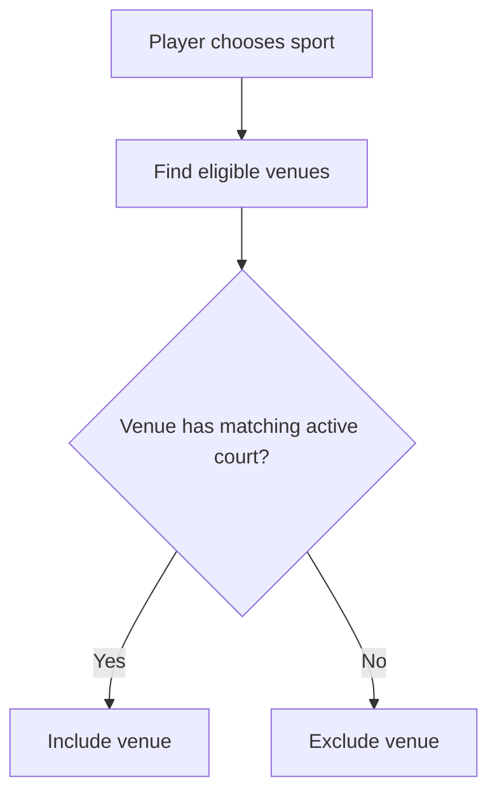
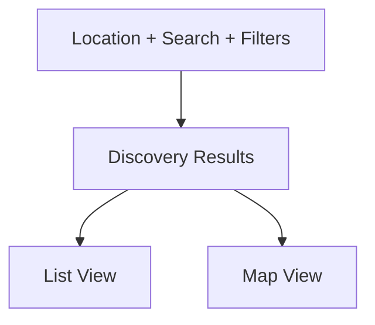
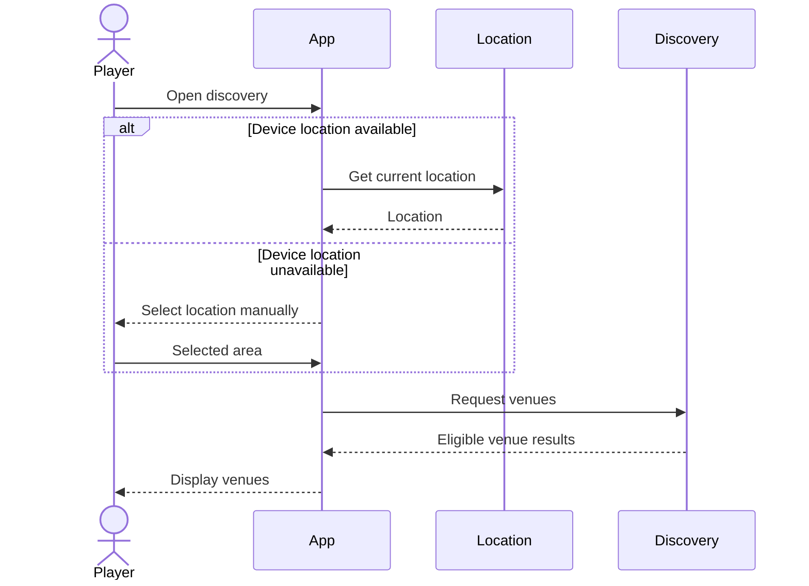
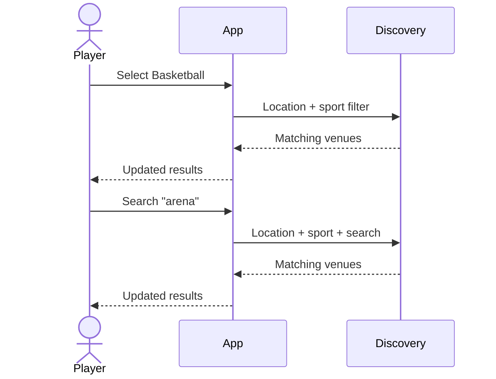
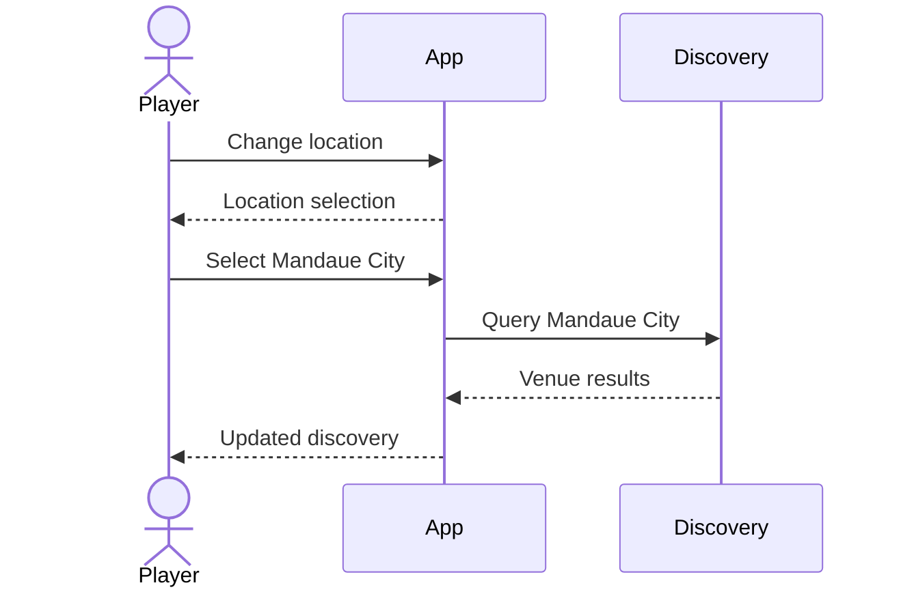

# Venue Discovery Specification

## 1. Purpose

This document defines how authenticated players discover sports venues for the MVP.

It specifies:

- Authentication requirement
- Current-location discovery
- Manual location fallback
- Nearby venue search
- Venue eligibility
- Search
- Sport filtering
- Location filtering
- List and map views
- Venue result data
- Empty and error states
- Acceptance criteria

This document describes product behavior only.

Geospatial database queries, map providers, permission packages, caching, ranking algorithms, and API implementation belong in architecture and API documentation.

---

# 2. Related Documents

This specification is derived from:

```text
docs/product/requirements.md
docs/product/mvp.md

docs/flows/player-discovery.md
docs/flows/booking.md

docs/specs/venue-court-management.md
docs/specs/availability.md
```

---

# 3. Actor

## Player

An authenticated player can:

- Establish a discovery location
- Browse venues near that location
- Search venues
- Filter by sport
- Change location
- View venues on a map
- Open venue details
- Select a court
- Continue toward booking

---

# 4. Authentication Requirement

## DISC-SPEC-001 — Authentication Required

Venue discovery is available only to authenticated players.

Unauthenticated users must not access nearby venue results.

Conceptually:

```text
Unauthenticated
      ↓
Authentication
      ↓
Player
      ↓
Venue Discovery
```

---

# 5. Discovery Location

Venue discovery must always operate against an active discovery location.

The location may come from:

```text
Device location
```

or:

```text
Manually selected location
```

The player does not need to grant device location permission to use discovery.

---

# 6. Device Location

## DISC-SPEC-002 — Current Location Discovery

When location permission is granted and a valid device location can be obtained, the application may use that location for nearby venue discovery.

Conceptually:

```text
Location permission granted
      ↓
Get current location
      ↓
Use as discovery location
      ↓
Find nearby venues
```

---

# 7. Location Permission Request

If location permission has not yet been requested when discovery is opened, the application may request permission.

If granted:

```text
Use device location
```

If denied:

```text
Use manual location fallback
```

Permission denial must not block the user from using the application.

---

# 8. Manual Location Fallback

## DISC-SPEC-003 — Manual Location Selection

A player must be able to manually select a discovery location.

This is required when:

- Location permission is denied
- Device location cannot be obtained
- The player wants to search somewhere else

---

## Manual Location Examples

The user may eventually search/select:

```text
Cebu City
Mandaue City
Lapu-Lapu City
Makati
Quezon City
```

The exact geographic selection UI is not defined here.

---

# 9. Changing Discovery Location

## DISC-SPEC-004 — Location Change

A player must be able to change the current discovery location.

Example:

```text
Current:
Cebu City

Change to:
Mandaue City
```

After changing location:

- Venue results should refresh.
- Map results should refresh.
- Existing search/filter criteria may remain where practical.

---

# 10. Active Location Indicator

The application should clearly indicate the location currently being used.

Example:

```text
Nearby venues

Cebu City
```

or:

```text
Nearby venues

Current location
```

This prevents the player from misunderstanding which area is being searched.

---

# 11. Nearby Discovery

## DISC-SPEC-005 — Nearby Venues

The system must return discoverable venues relevant to the active discovery location.

The exact geographic search radius and ranking are implementation decisions to be defined later.

---

# 12. Discoverable Venue Eligibility

A venue may appear in discovery only when all relevant conditions are satisfied.

At minimum:

- Venue is published.
- Venue has valid location data.
- Venue belongs to an active authorized gym owner.
- Venue has at least one active usable court.

---

# 13. Bookable Court Requirement

For MVP discovery, a published venue should have at least one court capable of participating in the booking flow.

Conceptually:

```text
Published venue
      +
Active court
      +
Valid court configuration
      ↓
Eligible for discovery
```

---

# 14. Venue Result Item

A discovery result should provide enough information for the player to decide whether to open the venue.

Possible information includes:

- Venue name
- Primary image
- Location
- Approximate distance
- Supported sports
- Pricing indicator
- Availability indicator

Exact card layout is not part of this specification.

---

# 15. Supported Sports in Discovery

Venue supported sports are derived from its courts.

Example:

```text
Venue A

Court 1 → Basketball
Court 2 → Basketball
Court 3 → Badminton
```

Venue sports:

```text
Basketball
Badminton
```

This derived model should be used for filtering.

---

# 16. Sport Filter

## DISC-SPEC-006 — Filter by Sport

A player must be able to filter discovery results by sport.

Example:

```text
Filter:
Basketball
```

A venue is included when it has at least one eligible court supporting basketball.

---

## Sport Filter Flow



---

# 17. Search

## DISC-SPEC-007 — Venue Search

A player must be able to search venue results.

Search may initially match:

- Venue name
- Location text
- Supported sport

Example:

```text
Search:
"badminton"
```

Possible matching result:

```text
Smash Sports Center
Badminton
Mandaue City
```

---

# 18. Search Scope

Search operates within the active discovery context where practical.

Example:

```text
Location:
Cebu City

Search:
Sports Center
```

The system should prioritize or return results relevant to the selected area.

The exact search ranking algorithm is outside this specification.

---

# 19. Search and Filters Together

Search and filters may be combined.

Example:

```text
Location:
Cebu City

Search:
"arena"

Sport:
Basketball
```

Results must satisfy the active product constraints.

---

# 20. Clearing Search and Filters

Players should be able to:

- Clear search text
- Remove sport filters
- Change location

After clearing filters, the discovery result set should update accordingly.

---

# 21. List View

## DISC-SPEC-008 — Venue List

Players must be able to browse discovery results as a list.

Example:

```text
Nearby Venues

ABC Sports Center
Basketball • Volleyball
1.2 km

Smash Badminton Center
Badminton
2.0 km

South Courts
Basketball
3.4 km
```

---

# 22. Map View

## DISC-SPEC-009 — Venue Map

Players should be able to view eligible venues geographically on a map.

Each displayed venue should correspond to a real discoverable venue result.

The map may include:

- Venue markers
- Current/selected player area
- Selected venue

---

# 23. List and Map Consistency

List and map views should represent the same active discovery context.

Conceptually:



If the player filters to basketball venues, the map should not continue displaying unrelated badminton-only venues.

---

# 24. Venue Selection From List

Selecting a venue from the list opens venue details.

```text
Venue List
   ↓
Select Venue
   ↓
Venue Details
```

---

# 25. Venue Selection From Map

Selecting a venue marker should allow the player to identify and open the same venue.

```text
Map Marker
   ↓
Venue
   ↓
Venue Details
```

---

# 26. Venue Details Entry

Discovery ends when the player opens a venue.

The venue details flow may display:

- Venue photos
- Description
- Address
- Map location
- Supported sports
- Courts
- Pricing
- Operating information

From there, the player can select a court and continue to booking.

---

# 27. Discovery-to-Booking Boundary

Selecting a venue does not create a booking.

Selecting a court does not create a booking.

A booking only begins after the player explicitly selects and submits an available slot.

Conceptually:

```text
Discovery
   ↓
Venue
   ↓
Court
   ↓
Availability
   ↓
Booking Request
```

---

# 28. Distance Display

## DISC-SPEC-010 — Approximate Distance

When sufficient location information is available, the system may display approximate venue distance.

Example:

```text
ABC Sports Center
1.8 km away
```

Distance is informational and does not need to represent navigation-route distance.

---

# 29. Manual Location and Distance

When the player uses a manually selected area rather than precise device coordinates, distance may:

- Be calculated from the selected location point
- Be omitted
- Be shown approximately

The system must not fabricate precision that it does not have.

---

# 30. Discovery Sorting

The exact ranking strategy is not yet finalized.

Possible factors may eventually include:

- Distance
- Relevance
- Availability
- Venue name

For MVP, discovery should prioritize predictable behavior over a complex ranking algorithm.

AI-based ranking is explicitly unnecessary.

---

# 31. No Results

## DISC-SPEC-011 — Empty Discovery State

When no venues match the active discovery criteria, show a valid empty state.

Example:

```text
No venues found.

Try:
- Changing your location
- Choosing another sport
- Clearing your search
```

No results should not be treated as a server error.

---

# 32. Location Failure

If device location cannot be determined:

```text
Device location failed
      ↓
Offer manual location
```

The user must still be able to continue discovery.

---

# 33. Location Permission Denied

Location permission denial is a supported application state.

The application should:

- Not repeatedly block the player
- Offer manual location selection
- Optionally provide a later action to enable location

---

# 34. Venue Loading Error

If venue results fail to load because of a backend or network error:

- Show an error state
- Allow retry
- Preserve location where practical
- Preserve search/filter selections where practical

---

# 35. Stale Discovery Results

Venue state may change while a player is viewing discovery.

Example:

```text
Player sees Venue A.

Owner unpublishes Venue A.

Player opens Venue A.
```

The system must validate current venue availability when venue details or booking data is requested.

Discovery results should not be treated as permanent truth.

---

# 36. Court State Changes

A venue may remain discoverable while a specific court becomes inactive.

The inactive court must not be presented as bookable.

If all usable courts become unavailable, venue discoverability should be reevaluated according to publication rules.

---

# 37. Search Result Privacy

Discovery must expose only venue information intended for players.

Private owner-management information must not appear in player discovery.

Examples of information that should remain private unless explicitly required:

- Internal owner identifiers
- Internal notes
- Administrative metadata

---

# 38. Discovery Sequence



---

# 39. Search and Filter Sequence



---

# 40. Location Change Sequence



---

# 41. Discovery Validation Cases

Possible conceptual cases include:

```text
AUTHENTICATION_REQUIRED
LOCATION_REQUIRED
INVALID_LOCATION
LOCATION_UNAVAILABLE
VENUE_NOT_FOUND
VENUE_NOT_DISCOVERABLE
DISCOVERY_LOAD_FAILED
```

These names do not define API error codes yet.

---

# 42. Discovery Invariants

## INV-DISC-001

Only authenticated players can access discovery.

## INV-DISC-002

Discovery always has an active location context.

## INV-DISC-003

GPS permission is optional.

## INV-DISC-004

Manual location selection must be available.

## INV-DISC-005

Only published eligible venues may appear.

## INV-DISC-006

Sport filtering is based on eligible court sports.

## INV-DISC-007

Search and filters apply to the active discovery context.

## INV-DISC-008

Map and list views must not intentionally use contradictory result sets.

## INV-DISC-009

Selecting a venue does not create a booking.

## INV-DISC-010

Displayed venue information may require revalidation before booking.

---

# 43. Acceptance Criteria — Authentication

- [ ] Unauthenticated users cannot access venue discovery.
- [ ] Authenticated players can enter discovery.
- [ ] Authentication state is validated before returning protected discovery data.

---

# 44. Acceptance Criteria — Location

- [ ] Player can use current device location when permission is granted.
- [ ] Player can deny location permission and still continue.
- [ ] Player can manually select a discovery location.
- [ ] Player can change discovery location.
- [ ] Current discovery location is visible to the player.
- [ ] Device-location failure falls back to manual location.

---

# 45. Acceptance Criteria — Venue Eligibility

- [ ] Draft venues are excluded.
- [ ] Unpublished venues are excluded.
- [ ] Venues without valid location are excluded from nearby discovery.
- [ ] Venues without usable courts are excluded where applicable.
- [ ] Published eligible venues can appear.

---

# 46. Acceptance Criteria — Search

- [ ] Player can enter a venue search query.
- [ ] Search updates the discovery results.
- [ ] Search can operate with active location.
- [ ] Search can work together with sport filtering.
- [ ] Player can clear the search.

---

# 47. Acceptance Criteria — Sport Filtering

- [ ] Player can select a sport.
- [ ] Only venues with matching eligible courts are returned.
- [ ] Player can remove the sport filter.
- [ ] Filter state updates list results.
- [ ] Filter state updates map results where applicable.

---

# 48. Acceptance Criteria — List and Map

- [ ] Player can view venue results in list form.
- [ ] Player can view venue locations on a map.
- [ ] Selecting a venue from either representation opens the correct venue.
- [ ] Active filters are reflected in both views.
- [ ] Invalid/private venues are not exposed.

---

# 49. Acceptance Criteria — Empty/Error States

- [ ] Zero matching venues shows an empty state.
- [ ] Network/server failures show an error state.
- [ ] Player can retry failed discovery loading.
- [ ] Location permission denial is not shown as a system failure.

---

# 50. Out of Scope

The MVP discovery feature does not currently include:

- AI recommendations
- Personalized ranking
- Social recommendations
- "Players near you"
- Trending venues
- Sponsored ranking
- Paid discovery boosts
- Semantic search
- Voice search
- Route navigation
- Travel-time estimates
- Public venue reviews
- Favorites
- Saved searches
- Complex multi-filter systems

These require explicit future product requirements.

---

# 51. Open Specification Items

## OPEN-DISC-001 — Nearby Search Radius

Determine how the system defines "nearby."

Possible examples:

```text
5 km
10 km
20 km
```

or a dynamic geographic strategy.

---

## OPEN-DISC-002 — Default Sorting

Determine the initial sorting rule.

Possible MVP options:

```text
Nearest first
```

or:

```text
Relevance first
```

---

## OPEN-DISC-003 — Manual Location Granularity

Determine whether manual selection is based on:

- City
- Municipality
- Barangay
- Map point
- Searchable location provider

---

## OPEN-DISC-004 — Availability Indicator

Determine whether discovery cards should show:

```text
Available today
```

or similar availability summaries.

This may require additional availability queries and should only be added if it materially improves discovery.

---

# 52. Specification Status

**Status:** Draft

Venue discovery is sufficiently specified for the MVP to support:

- Location-based browsing
- Manual fallback
- Search
- Sport filtering
- Map/list discovery
- Venue selection
- Transition into court and booking flows
